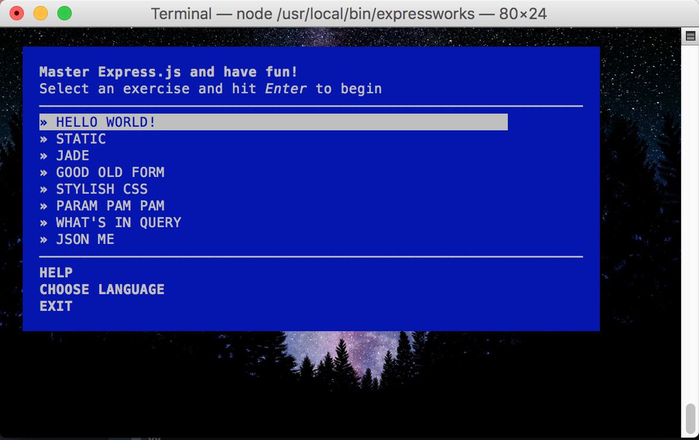
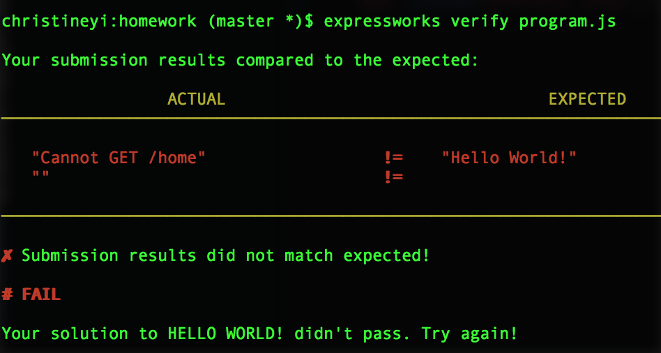
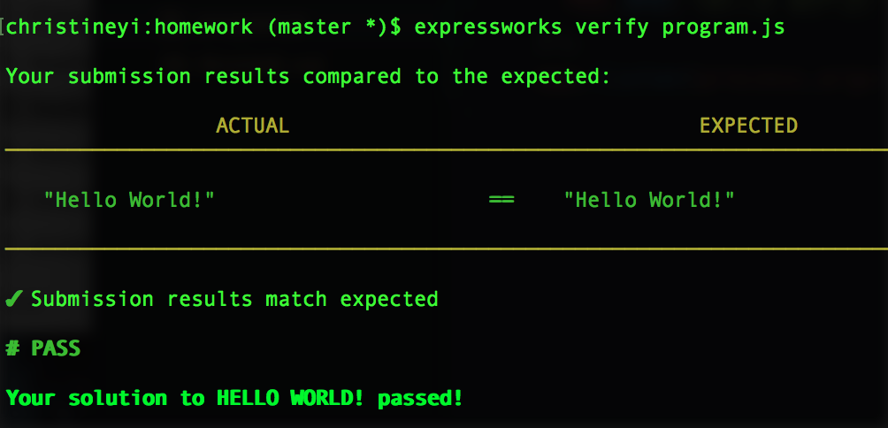

# Homework : Practicing Node and Express with NodeSchool

For tonight's homework, you'll be going through a [NodeSchool](http://nodeschool.io/#workshopper-list)
tutorial called [Expressworks](https://github.com/azat-co/expressworks).

## Exercise Objectives

- learn how to make an Express app through a self-guided tutorial
- gain more practice with the Command Line Interface (CLI) in terminal
- use Expressworks built in tests to check your work

## Setup

To set up and install the platform, run `npm install -g expressworks`.
Then, create a new blank file inside _this directory_ called `program.js`. You will be completing the exercises in this file.

To begin the tutorial, just type the command `expressworks` into terminal. You should see:

## Directions

Complete the following 5 exercises in order from the ExpressWorks tutorials:
  - HELLO WORLD!
  - STATIC
  - GOOD OLD FORM
  - PARAM PAM PAM
  - WHAT'S IN QUERY

You will cover all exercises except "JADE", "STYLISH CSS", and "JSON ME" since all of these lessons touch on material that we have not covered (and, for all but "JSON ME", will not be covering in this class). It is not necessary to complete a stage in order to move on; however, it would
be inadvisable to try to jump ahead very far.

> Challenge: Hints are provided for you in the tutorial on the bottom half of each prompt. See if you can complete the exercise without the help of the hints!

Each time that you start a level, in `program.js` write a comment indicating which level your
code is for. Then, comment out code from any previous steps.

When you complete a level, make a commit, and use the name of the
exercise (i.e. "STATIC") somewhere in the subject of your commit message.

.. Stuck?

- Make sure you properly installed expressworks with `npm install -g expressworks`. The `-g` ("global") tag means this package is installed globally in your machine and you can execute `expressworks` from any directory.

- Check your work by running the built in test `expressworks verify program.js`. Read the comments to help you find the error.

- Make sure you save `program.js` before executing the test

- Did you properly install npm packages? (ie. `npm install bodyparser --save`)

- This tutorial provides video guides, available under "hints" in the program. Videos going through the solution are listed [here](https://www.youtube.com/playlist?list=PLguYmmjtxbWGwQRxXqMTQCj6FNb55aFVo). You may use these to guide you.

### Testing Your Work

ExpressWork, just like all NodeSchool tutorials, comes with really handy built-in tests that
you can use to check your work. To run these tests, navigate into the directory
where `program.js` can be found and run `expressworks verify program.js`.
Expressworks will show you weather or not your code is working, and if it isn't,
it will give some reasons why.

Example of failed test:

Example of running the test again and passing:

Example of completed exercises:

### Reach Target

If you're feeling ambitious, try your hand at "JSON ME" -- it deals with JSON, a format
(much like HTML) for storing data as text. More information about JSON can be found
here:

[What is JSON?](http://www.w3schools.com/json/)

[How do we interact with JSON data in JavaScript?](https://developer.mozilla.org/en-US/docs/Web/JavaScript/Reference/Global_Objects/JSON)

[Official JSON Documentation](http://json.org/)

## Submitting Your Work

When you're ready, push the code to your fork on GitHub and create an issue with
a title in the format "YourGitHubUsername -- Week XX Day XX".
The issue body should have:

-   A link that points back to your fork.

-   A 'comfort' score on how you feel about the material, from 1 (very
    uncomfortable) to 5 (very comfortable)
