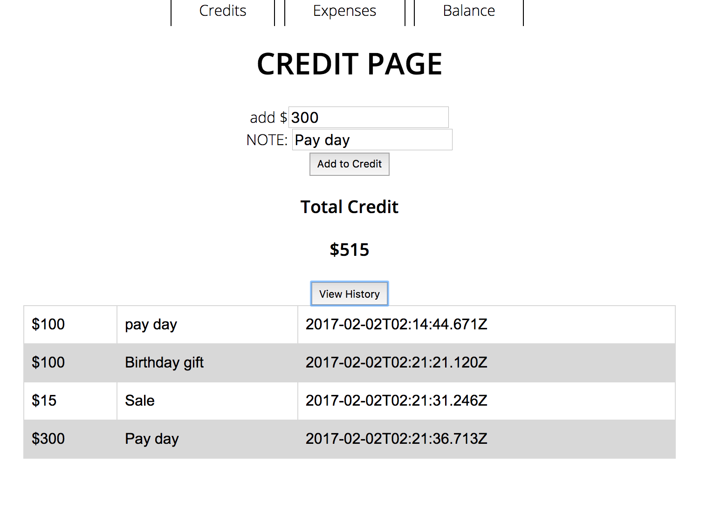
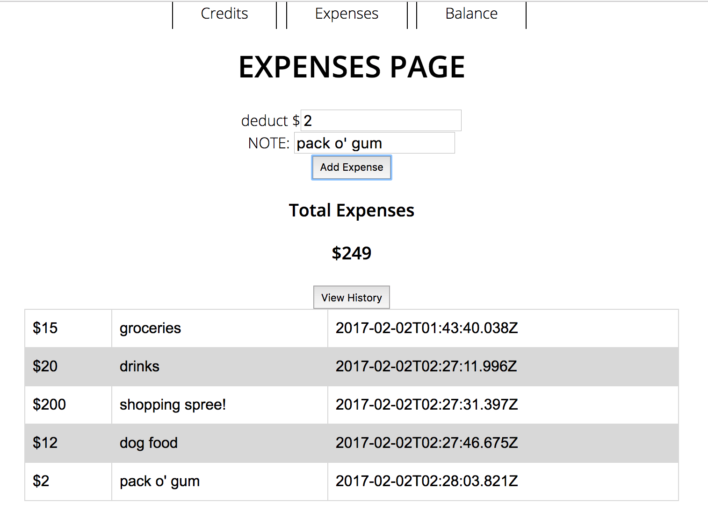
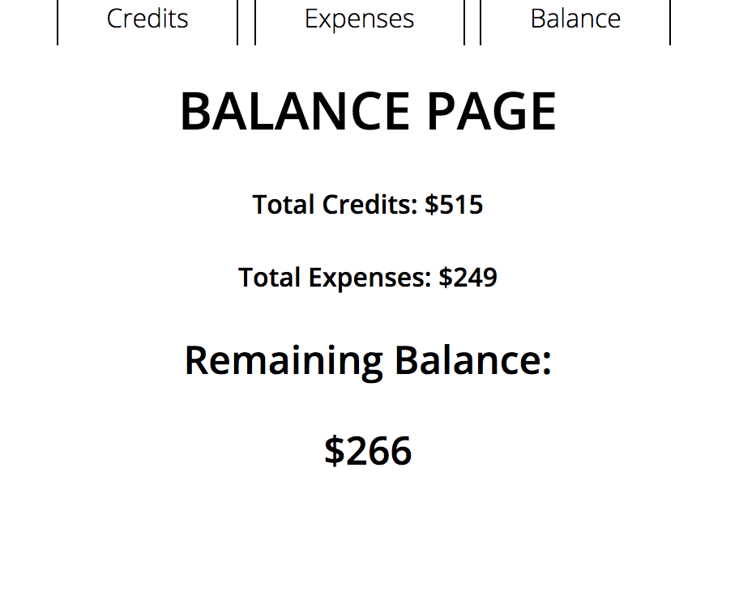

# Budget App ..from Scratch!

It's been a while since we've built an app from scratch, hasn't it? We're changing that tonight! You will create a single-page MEAN stack app to help keep track of our credits and expenses. And guess what..

:open_mouth: _There's no starter code!_

### Exercise Objectives

- tie it all together like a boss
- practice setting up an app from scratch

## Directions

You will create an app from scratch. I highly recommend you **do not** copy/paste a full app, full routes, full files, etc. Since we're about to head into Project week, use tonight's exercise to solidify all that you've learned to this point, think critically, and work **component by component.** Be able to explain each line of code and what it does.

You may use the guide (or not, there are many ways to do this app). Check off each spec as you work your way through. The steps are not necessarily in order (but it may help!) Feel free to make it your own.

:dart: Don't forget to Commit often!

## Back End Setup
### Setting Up Your App

- [ ] Create a folder called `budget_app`
- [ ] In it, run `npm init` to create a `package.json` file
- [ ] Set up a `server.js` file
- [ ] Add a `controllers` folder
- [ ] Add a `db` folder
- [ ] Add a `models` folder
- [ ] Add a `public` folder

### Setting Up Your Server: `server.js`

- [ ] Set up your requirements
- [ ] Set up middleware
- [ ] Set up a listener to `port:3000`
- [ ] Connect to `budget_app` in your mongo database
- [ ] Declare and require 2 controllers: `/credits` and `/expenses`
- [ ] Hook up your public folder

### Setting Up Your Schemas

- [ ] In `db` create a `schema.js` file
- [ ] Set up requirements in this file
- [ ] Your first model `Credit` has 4 properties:   `note`, `total`, `created_at`, `updated_at` (What data types are these?)
- [ ] Your second model `Expense` has 4 properties:   `note`, `total`, `created_at:`, `updated_at` (What data types are these?)
- [ ] Add a `pre('save'` function to both Schemas to create timestamps for `created_at` and `updated_at`
- [ ] Add `module.exports` and export the Models

### Setting Up Your Models

- [ ] Create separate files for your `Credit` and `Expense` models
- [ ] Require and export them.

### Setting Up Your Back-end controllers

- [ ] Create separate files for `credits.js` and `expenses.js`
- [ ] In both, set up requirements, including Router, and `module.exports`
- [ ] In both, create a GET "/" request that retrieves all records and send that data in the response
- [ ] In both, create a POST "/" request that will create and save a new record to the database

## Front End Setup
### Setting Up Your Public folder

- [ ] Create a `js` folder for your router and controller files
- [ ] Create a `partials` folder for your views
- [ ] Create a `css` folder if you want to add styling
- [ ] Create `index.html` as your default view page.

### Setting Up Angular

- [ ] Set up `index.html` This includes all your scripts.
- [ ] Bootstrap Angular to `index.html`
- [ ] Test to see if Angular works `{{2+2}}` should render as `4`
- [ ] Set up a module and controller in `js/controllers.js`

### Setting Up ui.router and Partials

- [ ] Set up `router.js` in the `js` folder
- [ ] Add 3 states: `credits`, `expenses`, `balance`
- [ ] Set up partials for each of these states `credits.html`, `balance.html`, `expenses.html`

### Start with Credits

### Work on Expenses

### Finish with Balance

### Strategies:

- Plan before you begin. Begin with the end in mind.
- Console log to make sure you know what data you're working with.
- Pseudocode and write what you are trying to do.
- Refer to your notes and check your SYNTAX!
- Don't worry about styling. Get it to function first.

## Submitting Your Work

  When you're ready to submit your work,

  1.  Add, commit, and push your code to your fork of the class repo.
  2.  File an issue on the class repo titled "Your Name -- wXXdXX".

  The issue should include:

  -   A link that points back to your fork.

  -   A 'comfort' score on how you feel about the material, from 1 (very
      uncomfortable) to 5 (very comfortable)
