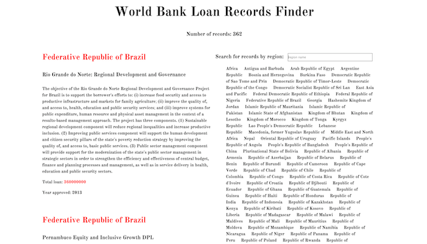
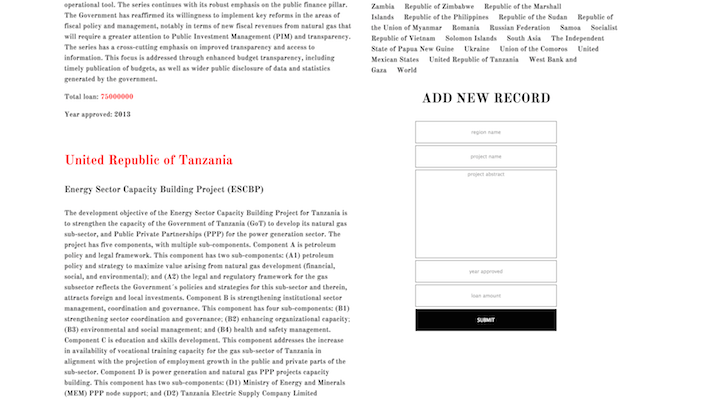
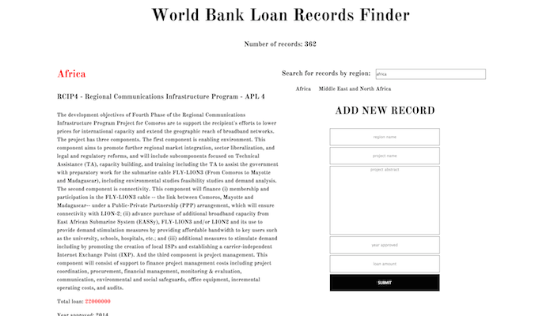
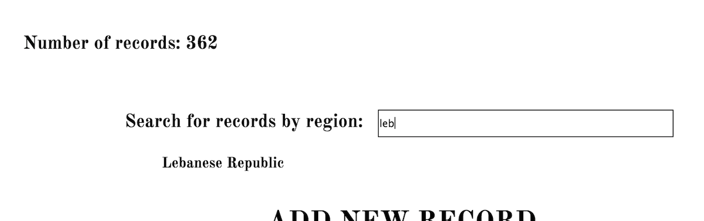

# WORLD BANK LOAN RECORDS FINDER

### Angular.js with $http


##APP

You will be provided with working server code that delivers an API of World Bank Loan data in JSON format. Your mission is to build an Angular front-end that makes use of the data.

######The app should display:
- A clickable list of all values associated with the `region` key in the database records. It's a list of all the region names with duplicates excluded.
- A dynamic list of all the records associated with a region when the region name is clicked
- The number of records in the database
- A search bar / filter box to narrow down the list of regions
- A working form to add a new record to the database
  - When the data is submitted and processed, the page should immediately reflect the changes 

Image below-- **TOP:** the number of records is displayed. **RIGHT**: All region names in the database, duplicates excluded. Search bar / filter box.  **LEFT:** All the records for a given region once the region name is clicked. </br></br>


</br>
</br>
</br>

Image below-- **RIGHT:** A form to submit a new record.</br></br>



</br>
</br>
</br>


Image below-- **RIGHT:** Putting input into the search/filter box changes the region list



</br>
</br>
</br>

Image below-- number of records and search/filter box



</br>
</br>
</br>

## STARTER CODE

#### SEED
You have a seed route within a seed controller. You can seed your database with all the World Bank records by going to `/seed` in your browser **once**.

#### WBINFO
You have a controller for serving Wbinfo data. You don't need to change these or anything else in the server. The routes are:

- `/wbinfo/count`
Serves up a count of all records in the database.

- `/wbinfo/uniqueRegions`
Serves up all values for the key `region` excluding duplicates.

- `/wbinfo/byName/:name`
Will deliver all records where the region name is the same as `req.params.name`

- There is also an index route `/wbinfo` for testing to see if all the data is there.

- And `POST /wbinfo` for creating a new record.

Use the information served by these routes in your Angular by using `$http` to get the information.

There is no front-end code given to you, you are building the entirety of the static component of the app in the `public` folder. Your front-end doesn't have to look anything like the examples given above, just as long as the information from the routes is used and the program flow works.

## ANGULAR

#### DIRECTIVES
- `ng-app`
- `ng-controller` you probably only need one
- `ng-repeat`
- `ng-model`
- `ng-click`
- `ng-submit` within a form element
- `| filter:`

#### DEPENDENCIES
- `$http`

</br>
	

## BONUSES
- List the region names alphabetically in the region list
- Include `delete` functionality (means adding a server route)
- Include `put` functionality (means adding a server route)
- Clear the form after submit

</br>

# NOTES


#### SUGGESTED STEPS
1. Get the number of records and display it on the page
2. Get the region names showing
3. Get click functionality on the region names working
	- Display records associated with a region
4. Get the search box working for fun
5. Add in the form for a new record and make sure data is flowing
	- Get the form to add a new record and immediately display it on the page

#### MODEL REFERENCE
######A `wbinfo` record has five strings
- `region`
- `projectabstract`
- `projectname`
- `year`
- `loanamnt`

</br>

#### VIDEO FOR IMPLEMENTING A SEARCHBOX (don't look if you don't want spoilers)

Final code around `3:32 - 3:40`  
https://www.youtube.com/watch?v=YFsduR7mBfY

</br>

#### NOTES ON FORM DATA IF YOU GET STUCK (don't look if you don't want spoilers)

Refer to Matt's Tuesday notes for a form that has its own controller. This is for making a form that belongs to the parent controller:

You can have an empty object in your controller like `formdata = {}` that can accept data from an `ng-model`, and process that object in a function bound to `ng-submit`.

```
<form ng-submit="ctrl.processForm()">
	<input type="text" placeholder="region name" ng-model="ctrl.formdata.region"></br>
	<input type="text" placeholder="project name" ng-model="ctrl.formdata.projectname"></br>
	<textarea type="text" placeholder="project abstract" ng-model="ctrl.formdata.projectabstract"></textarea></br>
	<input type="text" placeholder="year approved" ng-model="ctrl.formdata.year"></br>
	<input type="text" placeholder="loan amount" ng-model="ctrl.formdata.loanamnt"></br>
	<button type="submit">SUBMIT</button>
</form>
```


