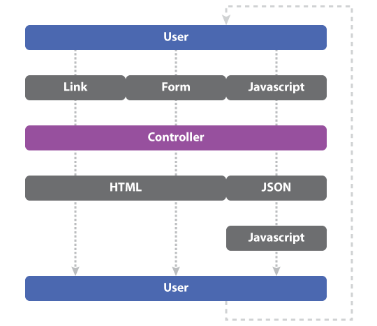
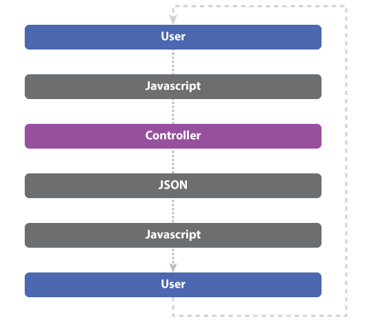
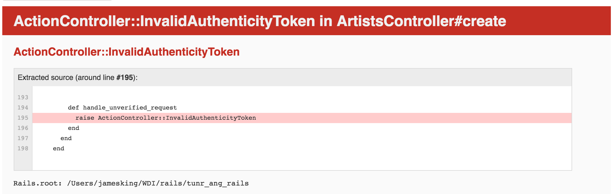

# Angular On Rails

## Learning objectives

- Give an example of when and why one might choose to put an Angular app on Rails.
- Explain whether a given file should be placed in `app/assets`, `lib/assets`, `vendor/assets`, or `public/`.
- Describe the difference between putting a static file in the asset pipeline versus in the `public` folder.
- Cause a certain Rails controller action to respond differently to both HTML and JSON requests.

## Framing

### Rails vs Angular

So far we've seen Angular apps with a limited back-end, and Rails apps with no front-end framework. Now we're going to combine the two and make a Rails app that uses Angular on the front-end.

We *have* made Angular apps that use *someone else's* back-end: APIs. This is different. We're going to create an Angular app that is "served" from the same server that provides the data. Our app will be using itself as the API.

### Why?

In a typical Rails app the user interacts with data through some combination of links, forms, and Javascript.



In an Angular-on-Rails app the user interacts with data just through Javascript.



This means they have a "single point of contact" with your data. This has two advantages: the user experience may have more consistency (AJAX vs page refreshes), and you have fewer moving parts to worry about.

The trade off here is the need to write more JS.

### Getting Started
Lets start out by setting up our environment.

```bash
rails new tunr_ang_rails -d postgresql
cd tunr_ang_rails
```

This sets up our Ruby on Rails project and generates our file structure.  Notice that in Rails 5, an empty `package.json` is created when you start a project.  Since this is already created, we can run the following `npm install` commands to get webpack set up.

```bash
npm install --save webpack
npm install --save glob
npm install --save babel-core babel-loader babel-preset-env babel-preset-es2015
npm install --save html-loader
npm install --save angular
```

Create a `.babelrc` file and add the following snippet
```json
{ "presets": [ "es2015" ] }
```

Finally create a `webpack.config.js` file and copy this webpack config we've created for you.
```js
require('webpack');
var glob = require('glob');

module.exports = {
    context: __dirname,
    entry: {
        app: glob.sync(__dirname + '/client/**/*.js')
    },
    output: {
        path: __dirname + '/app/assets/javascripts',
        filename: '[name].bundle.js'
    },
    module: {
        loaders: [
            {
                test: /\.js$/,
                exclude: /node_modules/,
                loader: 'babel-loader'
            },
            {
                test: /\.html$/,
                loader: 'html-loader'
            }
        ]
    }
};
```

Take a look at the `entry` and `output` path.  This shows us some important details about what our webpack config is doing.  In the entry object, we see that webpack is going to grab every `.js` file within the `client` folder.  It will then bundle all of the code up into an `app.bundle.js` and place it in the `/app/assets/javascripts` folder.  This means that the Asset Pipeline is able to take our bundled JavaScript and serve it without having to jump through any extra hoops!

Let's add a `client` folder that we will use to generate our Angular project. We'll also create an app.js file to serve as our root of the Angular application.

```bash
mkdir client
touch app.js
```

```js
//within app.js
const angular = require('angular');
angular.module('TunrApp', []);
```

Now if we run the `webpack` command, we should see that it successfully bundles the application and inserts it into our `app/assets/javascripts` directory.

With that, we can now start building Angular-On-Rails!

## Back-End: Ruby on Rails

### Model Set-Up and Seed
Now that we have our project properly set up, lets work on creating and seeding our data and serving it as an API for our Angular project to consume.

```bash
  rails g model Artist name photo_url nationality
  rails g model Song title album preview_url artist:references
```

Let's seed our database with our old tunr data. Copy the code for our seeds from this gist. [Tunr Seed Data](https://gist.github.com/king0120/a465fe25558c63bcb6d2a8091da1cea4)

Now let's create, migrate, and seed our database.  Then we can test and make sure that ActiveRecord can fetch the data we need

```bash
    rails db:create db:migrate db:seed
```

Finally, we'll add a has_many relationship to Artist
```ruby
# app/model/artist.rb
class Artist < ApplicationRecord
  has_many :songs, dependent: :destroy
end
```

### Create Routes
Let's use the resources command to generate nested routes for our two models
```ruby
# config/routes.rb
Rails.application.routes.draw do
  resources :artists do
    resources :songs
  end
end
```

### Generate Controllers
We now need to create controllers that can serve information from Postgres to our Angular front-end through an API call.  In order to do that, we need to make a minor change to the actions that we've been creating up to this point.

```bash
    rails g controller artists
```

```ruby
  def index
    @artists = Artist.all
    render json: @artists  
    #Overwrites the assumption to render an index.html.erb
  end
```

We have to use this `render json:` method throughout our RESTful routes.  By the end we will have something that looks like the following.

```ruby
class ArtistsController < ApplicationController
  def index
    @artists = Artist.all
    render json: @artists
  end

  def create
    @artist = Artist.create!(artist_params)
    redirect_to artist_path(@artist)
  end

  def show
    @artist = Artist.find(params[:id])
    render json: @artist
  end

  def update
    @artist = Artist.find(params[:id])
    @artist.update!(artist_params)
    redirect_to artist_path(@artist)
  end

  def destroy
    @artist = Artist.find(params[:id])
    @artist.destroy
    redirect_to artists_path
  end

  private

  def artist_params
    params.require(:artist).permit(:name, :photo_url, :nationality)
  end
end
```

Notice the lack of a `new` and `edit` action.  We don't need these actions, because we will not need individual views for a user to create or update their model. 

We should now have a working API.  Let's use Postman to test our actions.



Oh no! Rails is not allowing any requests that don't match localhost:3000. This is because of the Authorization Token that is normally sent over when a request is made.  For the sake of this demonstration, let's loosen the requirements for the Auth Token.

```ruby
class ApplicationController < ActionController::Base
  protect_from_forgery unless: -> { request.format.json? }
end
```

If we go back into Postman, we can now validate that our JSON API is working as intended.

## Front End: AngularJS

Now we have a working API. Let's use webpack to bundle our JS code and use Angular components to drive our UI.

### Angular Hello World

We installed Angular during an earlier step, but we still have a couple steps to go through in order for the application to work.

First, let's create a Welcome controller to serve as the root of the page.  We won't need to add any thing to the erb file, but we do need something other than the 'Welcome to Rails' page.

```bash
    rails g controller Welcome index
```

```ruby
# routes.rb
  get 'welcome/index'
  root "welcome#index"
```

Now if we reload the page, we should get a blank screen.  Let's add the `ng-app` tag to the `application.html.erb`.

```html
<html ng-app="TunrApp">
    ...
</html>
```

Next up, let's create an Angular module named "TunrApp"

```js
const angular = require('angular');
angular.module('TunrApp', []);
```

Finally, we need to make sure our application is updating the webpack bundler and the rails server at the same time.  To do this, we will take advantage of a gem called Foreman.  Foreman is a cli-tool which allows us to run multiple processes in one terminal window.  

```bash
    gem install foreman
```

Let's create a file called `Procfile` (no file extension)

```
    web: rails s
    webpack: webpack --watch 
```

```bash
    foreman start
```

Now webpack and our rails server are running at the same time. We can begin work on creating our single-page app.

### Writing Cleaner Front-End Code w/ ESLint
Eslint is a linting tool that allows you to write cleaner and easier to read code through providing error and warning messages when you write code that doesn't match up established best practices.  It's one of the big reasons I am a fan of VSCode (I believe there is also a plugin available for Sublime Text)

To install ESLint, we'll first need to globally install it. Then we will navigate to the root of the project and run the CLI.
```bash
  npm i -g eslint
  eslint --init
```

We'll then tell the CLI to answer questions about our style and after a few questions it will create an .eslintrc.js file.  If you're using VSCode, you will now automatically see error messages pop up with tips on how to clean up your code.

### Creating an Artist Controller
Let's create a component's folder, and an artists folder inside of that. We'll follow the web component standards that we learned during the Angular unit to create our controllers.

```js
  import artistsController from "./artists.controller";
  import artistsTemplate from "./artists.html";

  const artistsComponent = {
  	controller: artistsController,
  	template: artistsTemplate
  };

  angular.module("TunrApp").component("tunrArtists",   artistComponent);
```

```js
  ArtistsController.$inject = [];
  function ArtistsController(){
  	var vm = this;

  	activate();

  	function activate(){
      vm.artists = [{
        name: "Test artist",
        photo_url: "http://www.fillmurray.com/200/200",
        nationality: "USA"
      }, {
        name: "Test artist 2",
        photo_url: "http://www.fillmurray.com/205/205",
        nationality: "USA"
      }]
  	}
  }
  export default ArtistsController;
```

```html
<h1>Artists</h1>
<div class="btn btn-large" ui-sref="newArtist">+ New Artist</div>
<div class="artist-container flex">
    <div class="artist flex" ng-repeat="artist in $ctrl.artists" ui-sref="artist({id: artist.id})">
        </img>
        <div class="info">
            <h4>{{artist.name}}</h4>
            <div>{{artist.genre}}</div>
            <div>{{artist.origin}}</div>
        </div>
    </div>
</div>
```

### Setting up Angular UI-Router

Let's use UI-router to controll the flow of our front-end app.

```bash
npm i angular-ui-router --save
```

```js
const angular = require("angular");
require("angular-ui-router");

angular.module("TunrApp", ["ui.router"]).config(router);

router.$inject = ["$stateProvider", "$urlRouterProvider"];

function router ($stateProvider, $urlRouterProvider) {
	$stateProvider
		.state("home", {
			url: "/",
			template: "<tunr-artists></tunr-artists>"
		})
		.state("artist", {
			url: "/artist/:id",
			template: "<tunr-artist></tunr-artist>"
		})
		.state("newArtist", {
			url: "/artist/new",
			template: "<tunr-new-artist></tunr-new-artist>"
		});

	$urlRouterProvider.otherwise("/");
}
```

### You Do: (45 min)
Create a show, new, and edit page for artists using Angular.  Use test info for now.

### Connecting to the Rails API
So we now have a working front-end with multiple routes, and an API with data ready to serve. Let's connect them by using `$http`.

```js
const angular = require("angular");

artistService.$inject = ["$http"];

function artistService ($http) {
	const service = this;

	service.getAllArtists = function () {
		return $http.get("/artist").then(res => {
			return res.data;
		});
	};

	service.getArtist = function (id) {
		return $http.get("/artist/" + id).then(res => {
			return res.data;
		});
	};

	service.saveArtist = function (newArtist) {
		return $http.post("/artist", newArtist).then(res => {
			return res.data;
		});
	};

	return service;
}

angular.module("TunrApp").service("artistService", artistService);

```

Now we can inject the Artist service into our controllers to retrieve data from our Rails API.

### You do: 20min
Inject the Artist service into your controllers to retrieve info from the API

CONGRATS!! You've just built an application using Angular On Rails. Let's deploy to Heroku.

### Deployment
Before deploying the app, let's make sure to run `webpack` one last time to make sure that everything is bundled into the production code.  After we feel comfortable with our project, we deploy using the following commands.

```
  heroku create
  git push heroku master
  heroku run rails db:migrate db:seed
```

Voila, if all goes well you should have your app up and running in production.

## Closing

Independently, take 3 minutes to jot down use-cases and reasons when you would:

 - Build an Angular app by itself
 - Build a Rails app by itself
 - Build an Angular and Rails app
