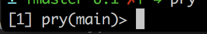

[](https://generalassemb.ly/education/web-development-immersive)

# Running your Ruby scripts

You'll interact with your .rb files in a very similar way to your .js files.

You'll use the `ruby` command and the repl `pry` instead of using $`node` like you did for Javascript.

### REALLY IMPORTANT

Ruby *DOES NOT* run in the browser. It is *purely* a server side. You will only be able to load it into the terminal.

Remember that Javascript runs server side as well as in the brower.


## Running ruby files

1. touch a file `test.rb`

2. add a line `puts "Hello from test.rb"`

3. run the file using ruby from the terminal $`ruby test.rb`

## Running ruby in the REPL

Ruby comes with a REPL called `irb` (Interactive Ruby Shell).  This is similart to us using the `node` command to write JS in the command line.  While irb is good for basic ruby, there is another option called `pry` which is like irb with superpowers.  We'll be using this throughout the course to debug.

## Installing Pry

1. To install `pry`, we will install a Ruby Gem.  This is similar to the packages that you install using `npm`.

```bash
  gem install pry
  gem install pry-doc
```

2. To start pry, simply type `pry` in the command line.  You should now see something like this.



3. You can now run any ruby code, similar to when we type JavaScript into `node`


## Loading files into pry

You can also load ruby files into the `pry` repl using the `load`

1. add a method to `test.rb`

  ```ruby
  def hello
    puts "hello from test.rb hello method"
  end
  ```

2. Start pry $`pry` in the same directory as your ruby file

3. In `pry` run `load 'test.rb'` it should return `true`. If it doesn't you likely did not specify the path correctly.

4. You should now have access to all the code in test.rb.
  - try invoking the `hello` method

5. Add a new method to test.rb

6. Run `load 'test.rb'` again and invoke the new function!

## Gaining command line superpowers in Ruby

Through `pry`, you have access to several commands that are commonly available in the command line.

Command line actions like `ls` and `cd` are available in pry.  This will allow you to explore various classes.  Since Ruby is an Object Oriented Language, this allows us to explore EVERYTHING.

Let's dive into the Array class.

```
cd Array
```

Your pry console should have changed from Main to Array


Now lets see what is available for us to use in the Array class.

```
ls
```

Using ls, we can see that there are plenty of methods available for us when using the Array class.  But what do these mean?  Lets use the pry-docs to figure out what an Array.reverse does

```
? reverse
```

Now you should see some documentation on what the method does!  This can be great in a pinch when you need to know what a method does.

## You do:
Use `pry` to explore some of the built in objects in Ruby.  Here are some of the most common.

* String
* Array
* Integer
* Time
* Range
