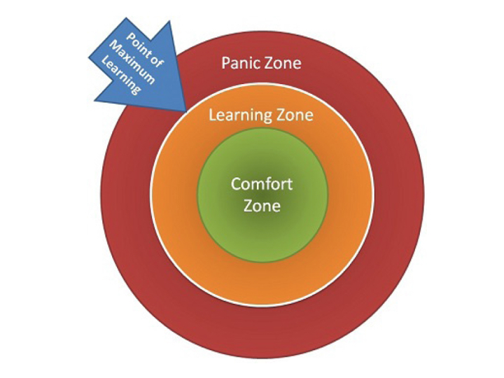
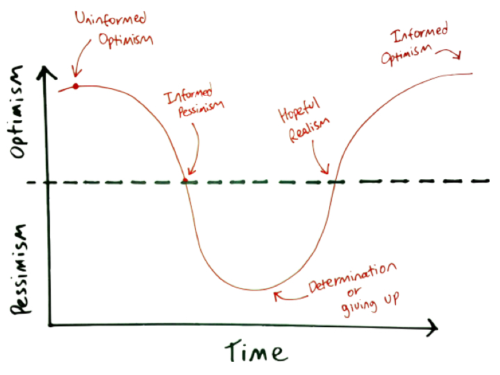

# Introduction to GA

## Instructor Introduction
- Danny Hurley - Instructional Lead
- Maren Woodruff - Instructional Lead
- Josh Kushner - Instructional Lead
- Lisa Holter - Teaching Assistant
- John Dupper - Teaching Assistant
- Larissa Boyce - Outcomes

## Roles (Danny)
1. Instructional Lead
  - Lesson Blocks
  - Code-alongs
  - Labs
  - Each instructor takes a different topic for each unit
2. Teaching Assistant
  - Morning Exercises
  - Diagnostics
  - Helping with homework
  - In class support
3. Outcomes
  - Outcomes sessions
  - Prioritize!

## Emotional Framing (Maren)
- Programming is not about learning a sequence of steps, it's about developing a mindset to solve problems and think programmatically.
- Language not important
    - critical/analytical/programatic thinking.
    - don't memorize, conceptualize ideas.
        - the internet is your notebook/memory
    - be able to adapt quickly
- Deal with chaos in your head. Being confused/lost is NORMAL. No one pays you because you know all the answers. The job is about jumping into confusion and being able to find a solution.
- Development can be very personal
	- Debugging your own mistakes
	- Being a good "Googler" and reading tech documents takes practice
	- You learn more by doing than by listening
	- We will not to hold your hand
		- There is a decent amount of failure that happens initially
			- good to get that out of the way before starting work
- ERRORS are GOOD
- Hard Work: 80-90hrs/wk minimum
- The maximum point of learning is right at the edge of learning and panic.

- This experience is a rollercoaster.

## You Are Not Your Code!(Maren)

https://vimeo.com/85040589

## Classroom Culture (Danny)
- Open safe environment
- Take ownership of your experience
- Check your ego at the door
- Empathy
- Don't compare yourself to others, compare yourself to who you were yesterday
- You get what you put in

## Mentorship Culture (Danny)
- Take care of each other
- Benchmarking; some are good at one thing, others at another. Leverage each other's strengths.
- Teaching is the best way of truly solidifying your understanding of a concept.
- Your classmates will be the best foundation for establishing a professional network in tech!
- Your classmates will be your number one best resource!
  - During projects
  - After class hours
  - COLLABORATE!!

## Student Expectations (Gabby)
1. Be Present
  - Attendance at 9:00 AM
  - Pay attention
  - Let us know if you are running late
  - Excused Absences
  - Multiple lateness = absence 
  - Contractual limit of absences in order to complete the program
1. Be Persistent
1. Be Independent
1. Be Thoughtful
1. Be Creative
  - this is not paint by numbers

## Plagiarism (Danny)
### Statement

General Assembly takes academic honesty very seriously, and as such will not tolerate any student who plagiarizes in order to satisfy class requirements.  Programs at General Assembly are intensive, require a lot of work on the part of the student, and students will occasionally not be able to complete work in a timely fashion.  

Rather than rely on work that’s not your own to create the appearance of success, let your instructional team know as early as possible that you are not prepared for the work.  It is much easier to come up with a plan, than it is to succeed if you’ve been removed from the program.

### Definition

Plagiarism is the act of claiming that work that does not belong to you is in fact your own.  It can take many forms, and each concentration at General Assembly will have a slightly different guideline to identify plagiarism in their field.  

Generally it is safe to assume that if you are including work that does not belong to you in an effort to build on your own work — cite it.  If you are using work that does not belong to you as a replacement for your own work, you’re probably plagiarizing.

Plagiarism includes copying homework solutions and switching content around.

### Procedure

If an instructor is in doubt of a students work or has evidence of plagiarism, the student will be asked to justify the work they've submitted. This often is in the context of making you explain your code line by line. Should they be unable to show the work they have claimed as their own is in fact theirs, the student will face disciplinary action.

Instances of plagiarism will be evaluated on a case by case basis, but will most likely result in removal from the program

## Intro to Assessments and Exit Tickets (Gabby)

## Stand-Up (Danny)
- Yesterday (What's been a win since your last Standup?)
- Blockers (What is something you'd like to see again since your last standup? What is still challenging you?)
- Today's wins (What would you like to accomplish today?)
- `Stand-ups should focus on generating ACTIONABLE goals for each day.`

## Common Student Worries (Maren)
1. I'm making a lot of mistakes
2. Imposter syndrome
3. I don't "do" math
4. What's the best practice? Finding the one "correct" answer
	- Best practices change constantly and from company to company
	- If you think properly, you'll probably naturally arrive at a best practice
	- All that matters is "Does it work?"
		- Use your time to learn new technology or strengthen your problem solving
5. Having a perfect understanding of everything
	- Class is set up to accommodate students of all abilities
		- Scaffolded lecture notes, homework, and projects
	- We make sure you understand at least the most important concepts
6. Having an amazing portfolio/completing all assignments
		- what matters is the ability to think
	- don't worry about completing every lab/homework
		- they're there as an exercise in thinking
		- completing and sleeping for 2 hours is worse than sleeping and not completing
7. Asking the instructional team questions
	- For lecture and labs, ask questions constantly
	- For Homework, queue up with the evening TA
		- This will force you to do some debugging on your own, but it will also give you a quick resource if you're stuck
	- Projects is your time to see what the real world will be like
		- the more time you spend fixing, the more you learn
		- receiving an answer stops the learning process
		- only ask a question if you've been stuck for about a day

# Activities

## Briefly Tell Us About You
- What's your name?
- Where are you from?
- What were you doing before WDI?
- What do you hope to do with your WDI skills?
