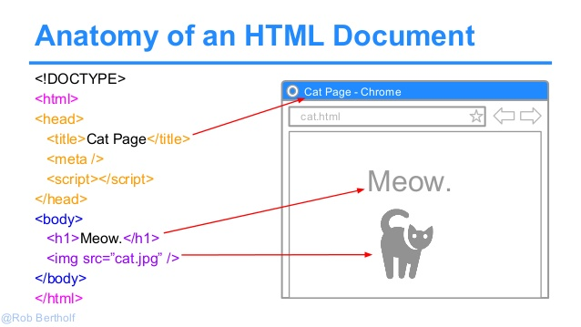

[](https://generalassemb.ly/education/web-development-immersive)

# HTML - Tags, Content, Attributes, & Semantic HTML

## Lesson Objectives

1. Describe what HTML is
1. Describe what a tag is
1. Describe what the content of a tag is
1. List some common tags
1. Describe what the attributes of a tag do
1. List some common tags that have attributes
1. Describe what Semantic HTML means

## Hook - 10 min

- Fist to Five
    - 1 - Very uncomfortable
    - 5 - HTML Rockstar
- I look at everything as HTML (e.g. menus, magazines, airline saftey cards)
- Discuss the parts of a newspaper as HTML elements
- A fun bookmarklet that I like to use is [Wirify](https://www.wirify.com/). It converts any webpage into a wireframe.

<br>

## Describe what HTML is - 10 min

HTML stands for "Hyper Text Markup Language". It is not a general purpose programming language like *JavaScript* or _Ruby_ but rather a _markup_ language, i.e. a language for representing structured text.

> You may find it interesting that this lesson is written in a language called `markdown` that gets converted to HTML `markup` language. Click on the `Raw` button to view the syntax.

HTML is the skeleton of a website. It is the *structured content* of the website. 

> You can also think of HTML as a blueprint and the rendered page as a building structure

<br>

## YOU DO - Questions

- What are self-closing tags? Give 3 examples. 
- Describe an HTML tag and it's components.
- What are `link` and `script` tags used for?
- What are the 4 tags that a basic html page must have.
- What is Accessibility? Provide 2 examples of HTML tags that reflect this concept. 

<br>



The `<head>` section is for metadata and the `<body>` section is for the visible content of the web page.

```html
<!doctype html>
<html>
  <head>
    <!-- document metadata goes here. -->
  </head>
  <body>
    <!-- document contents go here. -->
  </body>
</html>
```

<br>

## Describe what a tag is - 5 min

HTML creates this meaning by surrounding text with tags.  Tags look like this: `<example-tag></example-tag>`.  Note that there is an opening and a closing part of the tag.  We call these "opening" and "closing" tags.


<br>

## Describe what the content of a tag is - 5 min

Between the opening and closing tags, we insert the text or "content" of the tag.  The final result would look like this: `<example-tag>Content Goes in here</example-tag>`.  Tags can also be placed within other tags:

```html
<outer-tag>
  <inner-tag></inner-tag>
</outer-tag>
```

Note that when placing a tag inside another tag, you should indent the new tag to show it is a child of its parent tag.

##### Example of an Anchor containing an Image

```html
<a href="www.w3.org" target="_blank">
  
</a>
```

#####QUESTION
<details>
<summary>Can anyone explain the HTML above?</summary>
    The `href` above makes the image "clickable" and redirects to the W3 website.

</details>

<br>


#####WE DO - 20 min

As a quick review, I will give you some examples of broken HTML and you tell me what's wrong with them. 

[HTML Fixit](./html_fixit.md)

<hr>

<br>


# WE DO - CODE ALONG -  90 min 


## List some common tags

In general, we don't create our own tags.  Instead there are a set of predefined tags with functionality already associated with them.

### Initializing a page

Every site should start with:

```html
<!DOCTYPE html>
<html>
  <head></head>
  <body></body>
</html>
```

1. The DOCTYPE tag is special and doesn't get closed.  It also is the only tag that can have non-alpha-numeric (letters/numbers) values in it.
1. html: shows where the html begins
1. head: contains content specifically for the browser, not the user, to see (e.g.- meta tags, google analytics scripts).
1. body: contains all the content that the user will see when viewing the html in a web browser like Chrome, Firefox, etc.

### meta tags

| Element        | Description                                               |
|:-------------- |:--------------------------------------------------------- |
| `<link>`       | used to load a CSS file - it is self closing. |
| `<script>`     | used to load a JavaScript file or for embedding JavaScript code. |

<br>

**YOU DO**

1. Create the initial structure of the page
    - `cd ~/dev`
    - `mkdir html_css_intro`
    - `cd` into the folder
    - `touch index.html`
    - `atom .`
    - Create the basic html structure
2. Add meta tags for external `css` and `javascript` files.

<br>

**YOU DO - 2 minutes**

I want you to put every html tag you can think of into Slack with a description. Don't worry about duplicates and don't overthink it. Just type 'em in there!

For example: `<p></p>` - paragraph tag, block element, used for basic text on a page

### basic tags

1. h1, h2, h3, h4, h5, h6
  - These are headers.  Imagine you're giving a lecture and you want to have an outline.  These will help a computer/programmer figure out what are the title, sub sections, sub-sub sections, etc. of your outline.
  - The lower the number, the more important the header is.  h1 tags are generally the title of the page.  h2 denote a section, and so on.
1. p
  - These are paragraphs

### specific structure

Of course a website is more than just headers and paragraphs, though.  It has many sections to it that a normal outline doesn't.  Here are some of the more common tags we use to give structure to the page

See also [HTML5 New Elements](http://www.w3schools.com/html/html5_new_elements.asp)

1. header
  - could contain elements like a log and a nav bar.  Perhaps the title of the page too?
1. footer
  - could contain disclaimers, copyrights, and less important links (privacy, terms and conditions, legal, etc).
1. main
  - the bulk of your site goes in here
1. section
  - within some of the tags listed above, there can be different sections.  Use this tag to block each section off
1. nav
  - this will hold navigation links
1. article
  - if you're writing a blog, or have a page with many self contained sections, this might work well
1. aside
  - this is for tangential material.  Sidebars, inserts, etc.

<br>

**YOU DO**

In the `index.html` file you created earlier...

1. Add a `header` tag for your post WDI plans
2. Add `title` tags and empty `nav` tags inside the `body` 
3. Add a `main` section
4. Add a `footer` section with your name
<br>

### generic structure

Sometimes we need a tag that doesn't fit into any of the previously defined categories.  If this is the case, we can use one of two generic tags

1. div
  - used to block out chunks of content
1. span
  - use to block out small bits of content (e.g. words, sentences, etc)

### elements

Some elements are not structural, but actually make the content display differently

1. ul/ol/li
  - creates a list, either unordered (ul) or ordered (ol)
  - inside each `ul` or `ol` is a set of `li` list item elements.

### styled text 
1. em
  - this will emphasize a chunk of text, usually making it italics
  - best practice- use **em** instead of **i**
1. strong
  - this will emphasize a chunk of text, usually making it bold.
  - best practice- use **strong** instead of *b*

  > NOTE: You should usually avoid these tags as it is better to use CSS for styling content.
  
<br>

**YOU DO**

In the `index.html` file you created earlier...

1. Add a `ul` with 4 `li` tags to your `nav`
2. Add styled text tags to some piece of content
3. Add a `span` tag to a small piece of content
  
<br>

### decorative elements

Some elements do not contain content and instead are purely for decoration.  Elements that do not contain content are written like so `<no-content-tag/>`.  Note there is no closing tag and the slash comes before the final `>`

1. hr
  - horizontal rule, `<hr/>` creates a divider
1. br
  - break, `<br/>`, starts a new line in a chunk of text.

<br>

## Describe what the attributes of a tag do

We can add more meaning to a tag by adding "attributes" to it.  It looks like `<some-tag my-attribute="attribute-value"><some-tag>` or `<self-closing-tag attribute="value"/>`.  Again, in general, we don't create our own attributes, but instead choose from predefined ones which have specific functionality depending on what tag they're attached to.

| HTML          |  Example                              |
|:-------------:|:------------------------------------- |
| attribute     | `<a href="www.google.com">Google</a>` |

<br>

**QUESTION:** What are some attributes that we add to HTML tags?

<br>

## List some common tags that have attributes

1. a
  - Anchor tag.  Creates a clickable link to another page.  Uses the `href` attribute to do so
  - example: `<a href="http://www.google.com">This link will go to Google</a>`
  - note that the actual URL (location) of the page is hidden, and that only the content is shown.
1. img
  - self closing, but contains a `src` attribute with is the URL to an image
  - example: ``
1. video
  - like `img` but goes to a video
  - example: `<video src="http://www.w3schools.com/html/mov_bbb.mp4"/>`
  - also has attributes like `autoplay`, `controls`, `loop`
1. audio
  - like `img` and `video`
  - example: `<audio controls="true" src="http://www.w3schools.com/tags/horse.mp3"/>`

<br>

**YOU DO**

In the `index.html` file you created earlier...

1. Add a link to your GitHub repo in the `footer` section of your page.
2. Add an image to your page


<br>


## HTML Cheatsheet

There is an [Anatomy of an HTML Document](images/html-cheat-sheet-v1.png) cheatsheet at the bottom of this lesson. Check it out.

<br>


## Describe what Semantic HTML means

The most important thing to remember is that these tags and attributes are supposed to give structure and meaning your content, not appearance.  Sometimes you might want the title of the page to be smaller than the titles of the sub sections.  You should still use the tag that conveys the proper meaning, even if it doesn't look right.

<br>

_STOP READING HERE AND WORK ON THE [HTML PRACTICE EXERCISE](../student_labs/html-practice-and-review.md)_

<br>

## Review Questions - 10 min

1. Why should we use the `<strong>` tag instead of the `<b>` tag?
2. What does Accessibility mean?
3. What is [HTML5 Boilerplate](html5-boilerplate.md)?

<br>


## Labtime - 60 min

### Exercise #1

[Practice Exercise](../student_labs/html-practice-and-review.md) HTML Mockup for a Blog

### Exercise #2

Using HTML tags only (don't worry about CSS), use the starter code below to recreate the Document Outline for the following website:

[How We Use Energy](http://needtoknow.nas.edu/energy/energy-use/)

* [Starter Code](../student_labs/energy-html-outline/energy_document_outline.html)
* [Finished Code](../student_labs/energy-html-outline/energy_document_outline_fin.html)

### Exercise #3

Work on the [Busy Hands](../student_labs/busy-hands) exercise in your Unit 1 -> Week 1 -> Day 2 -> student labs folder.

<br>

## Additional Resources

* [HTML5 Boilerplate](html5-boilerplate.md)
* [Accessibility](http://www.clarissapeterson.com/2012/11/html5-accessibility/)
* [Online HTML live editor](https://thimble.webmaker.org/en-US/projects/wrangler/)
* [HTML element reference](https://developer.mozilla.org/en-US/docs/Web/HTML/Element)
* [HTML Elements by Category](http://www.w3schools.com/tags/ref_byfunc.asp)
* [HTML5 element reference](https://developer.mozilla.org/en/docs/Web/Guide/HTML/HTML5/HTML5_element_list)
* [Tim Berners-Lee](http://www.w3.org/People/Berners-Lee)
* [Evolution of the Web - Great Link](http://www.evolutionoftheweb.com/)
* [Stack Overflow: What is the difference between Section and Div](http://stackoverflow.com/questions/6939864/what-is-the-difference-between-section-and-div)
* [HTML5 Doctor](http://html5doctor.com/)
* [HTML5 Validator](http://html5.validator.nu/)
* [Semantic HTML](http://en.wikipedia.org/wiki/Semantic_HTML)

<br>

## HTML Cheatsheet


