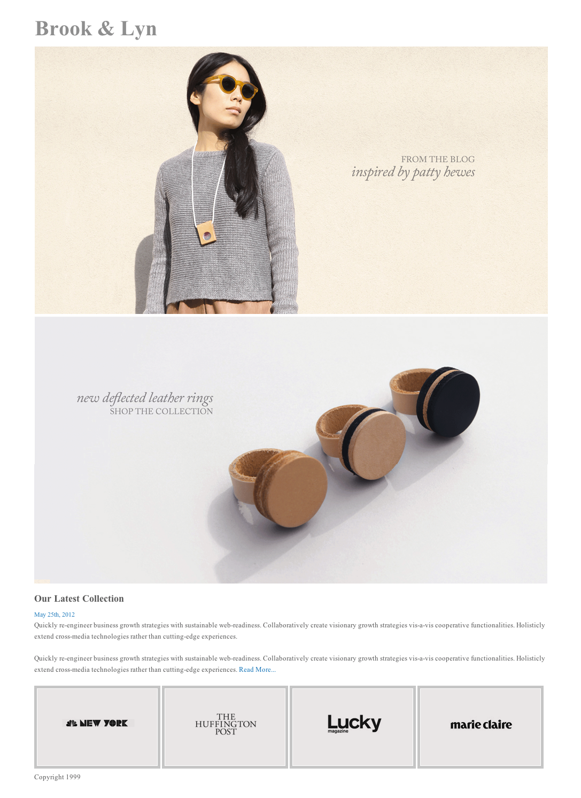

# Homework : Layout

## Setup

Make sure that you are on the `master` branch of your `wdi-remote-...` repo.
Then run `git pull upstream master` to pull the latest materials from the
instructors' repository. You shouldn't hit a merge conflict here, but if you do,
flag down an instructor right away.

## Brook & Lyn: A layout exercise

The graphic designer of fashion brand Brook & Lyn has created a simple layout for the company's webpage. The mockup and images are passed to you, the developer, to turn this concept into reality using HTML and CSS. Your goal is to recreate the site as close as possible to this mockup, so pay attention to the details and plan accordingly (which HTML elements should be used for which part of the layout? padding/margin, font-size, etc.)

Refer to the mockup: the visual elements live within a centered container, and the bottom row is laid out in the inline style.

#### Exercise Objectives

- gain meaningful experience using html & css skills to build a complete layout
- gain meaningful experience centering a container div
- gain meaningful repetitions using `inline-block` to lay out a list of elements in a row

#### Directions

1. Write the HTML in `index.html` and CSS in `css/style.css` to recreate the layout seen below. The images are provided for you in the `images` directory. The CSS is already linked to your `index.html`.

#### Layout

#### Reach Goals:

- Refactor your code and use `%` (left/right values) and `em` (bottom/top values) instead of fixed `px` values to make the site responsive to the browser width.
- Make it so that the title 'Brook & Lyn' is a fixed header/nav-bar and doesn't move when you scroll through the page.
- Let's add Javascript (or jQuery, your choice) and make this fun & interactive in `script.js`!
  - Clicking on the title "Brook & Lyn" changes the title to a pink Color
  - Mousing over one of the bottom images will change that image's border to black
- Change the font (ex. [GoogleFonts](https://fonts.google.com/))

## Submitting Your Work

  When you're ready to submit your work,

  1.  Add, commit, and push your code to your fork of the class repo.
  2.  File an issue on the class repo titled "Your Name -- wXXdXX".

  The issue should include:

  -   A link that points back to your fork.

  -   A 'comfort' score on how you feel about the material, from 1 (very
      uncomfortable) to 5 (very comfortable)
