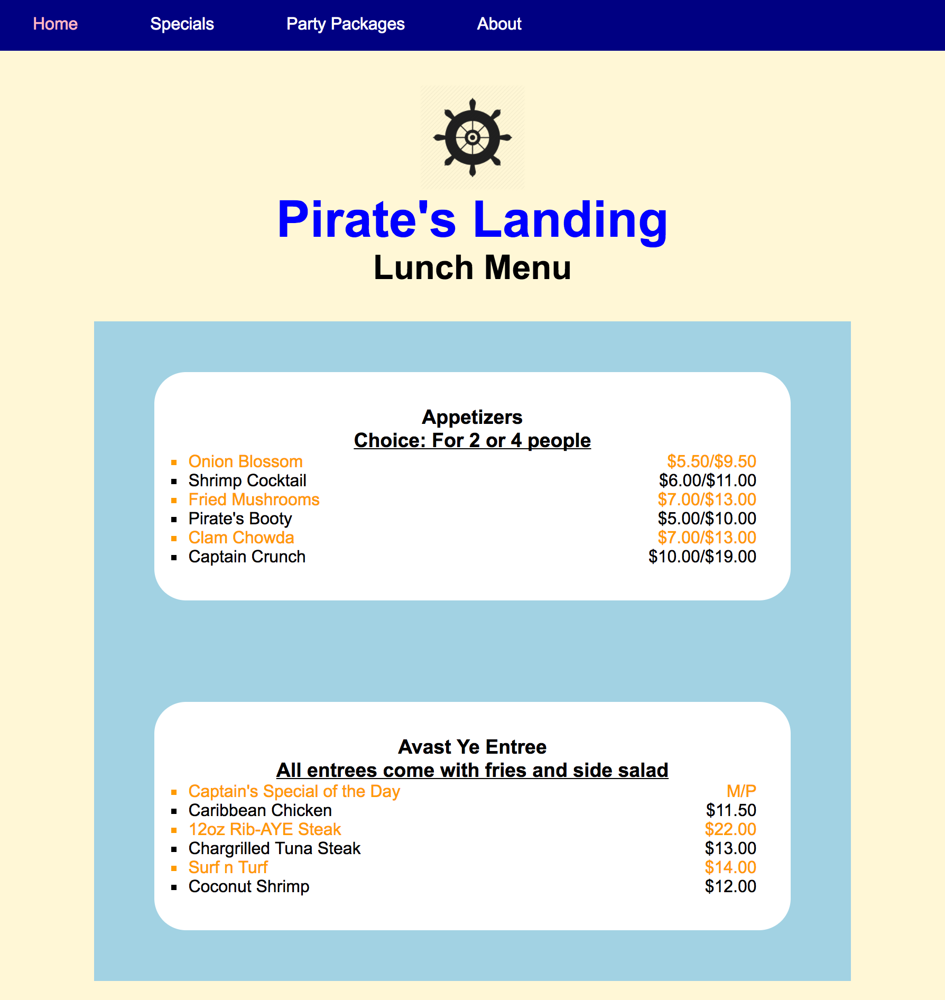

# Homework : Advanced and Pseudo Selectors

## Setup

Make sure that you are on the `master` branch of your `wdi-remote-...` repo.
Then run `git pull upstream master` to pull the latest materials from the
instructors' repository. You shouldn't hit a merge conflict here, but if you do,
flag down an instructor right away.

#### Exercise Objectives

- gain more experience using CSS skills to build a complete layout
- get more practice styling with advanced and pseudo CSS selectors to keep HTML "DRY"
- gain more experience styling a container and child div
- gain meaningful repetitions using `inline-block` to lay out a list of elements in a row

#### Directions

1.  Touch a `style.css` file in the `pseudo_selector` homework folder. In it, use CSS selectors, including advanced and/or pseudo selectors, and CSS properties to recreate the layout seen below. You will *not* be modifying any of the HTML in `index.html`, as it is provided already. The logo image is provided for you in the `images` directory.

After completing each spec, make a commit with the message being the spec itself.

##### Specifications:
  - To begin, set ALL elements to `padding: 0; margin: 0`
  - The `<nav>` spans the entire width of the page, with a height of 50px, and has white text
  - The nav `<li>` links are spaced out without the bullet points
  - Hovering over the `<nav>` links turn the links' background to lightblue.
  - The logo is 100px wide and centered in the page
  - The first `<h1>` is blue and its font-size is 3x larger than a normal h1 tag
  - All divs are centered on the page. The 2 menus' outer divs are lightblue, the inner divs are white with rounded corners
  - All headings are centered
  - The bottom `<h3>` in the menus are underlined
  - The `` prices are aligned on the right side of its div
  - The main menus' `<li>` have square bullets
  - Every other `<li>` is colored orange, starting with the first one

#### Layout

#### Reference
Check out a [list of CSS Selectors](http://www.w3schools.com/cssref/css_selectors.asp) from W3 Schools.

#### Reach Goals - More Advanced Selectors!

- Using only CSS:
  - Change the last `li` in the `nav` bar to capital letters
  - The text should turn green when you hover all even-numbered `li` in the menu
  - All visited links should be colored pink
  - Remove the last div's background color, and use a border of your choice instead
  - Bold every 3rd `span` tag

#### Super Reach Goal
- Create a new `css` file called `no_class.css`
- Link it up to your `index.html` and comment out the link to `style.css`
- Remove both classes in `index.html` (ie. "class="appetizers-container" and class="entrees-container")
- In `look_ma_no_class.css` work through the specs again, and see if you can use ONLY selectors to style your page without the help of classes.
- Change the 2nd and 3rd div backgrounds to darkblue

## Submitting Your Work

  When you're ready to submit your work,

  1.  Add, commit, and push your code to your fork of the class repo.
  2.  File an issue on the class repo titled "Your Name -- wXXdXX".

  The issue should include:

  -   A link that points back to your fork.

  -   A 'comfort' score on how you feel about the material, from 1 (very
      uncomfortable) to 5 (very comfortable)
