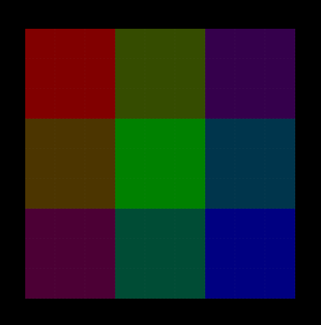
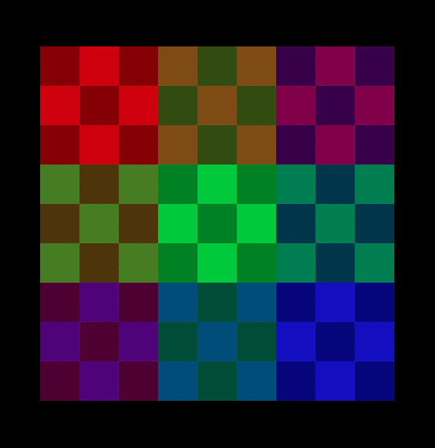

# CSS Color Box Thing

#### AKA: Fun with pseudo-selectors!

Replace all of the `.replaceMe` in the CSS with one or more selectors to make this:

## Goal 1

## Bonus

You don't need to touch the HTML, nor do you need to add in any new CSS properties -- all you're doing is adding in *selectors*.

There's no right answer!
