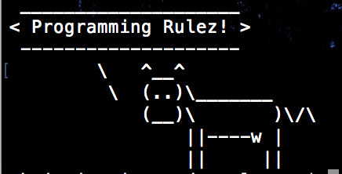
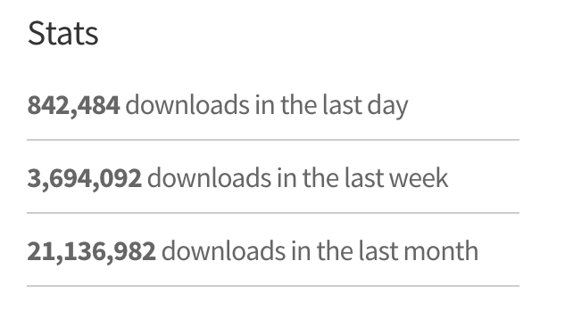

[](https://generalassemb.ly/education/web-development-immersive)

# Homework : Intro to Node


## Setup

Make sure that you are on the `master` branch of your `atl-wdi-...` repo.
Then run `git pull upstream master` to pull the latest materials from the
instructors' repository. You shouldn't hit a merge conflict here, but if you do,
flag down an instructor right away.

#### Exercise Objectives

- gain practice  installing `npm` packages (globally & locally) on terminal
- gain practice executing code with self-guided reading of documentation
- gain familiarity with popular packages on [npmjs's official site](https://www.npmjs.com/)
- introduce [Express](http://expressjs.com/), a web app framework


### Part 1 : Globally installing a package with npm
#### Directions
- Globally install the  [cowsay](https://www.npmjs.org/package/cowsay) `npm` package (you can run this in any directory)
- Read the documentation for cowsay and give the cow a unique message through terminal
- Select an option from `cowsay -h` to modify your cow, and run another unique message
- Take a screenshot of your terminal output and add that image to your homework folder

*Example Output*



<details><summary>.. Stuck?</summary>
- Did you properly install `cowsay` using `npm install cowsay -g`?
- You can check you have successfully installed it if typing `cowsay` in terminal doesn't return an error
- to add a modification on your cow, use `cowsay -h` for a list of options. Select your choice, and add that tag (ie. -p, -s, -t) to your `cowsay` command in terminal

</details>


### Part 2: Make a command line app
#### Directions
- create a `pirate_jokes` folder to the current `homework` directory
- `cd` into that folder
- run `npm init`
  - press "enter" to go through all of the prompts you'll get in the terminal

*Requiring Node Modules*
 -  Locally install the [node-notifier](https://www.npmjs.com/package/node-notifier) package to `pirate_jokes`
 -  Touch a `main.js` file in your `pirate_jokes` directory
 -  Type the following code in `main.js` and save it:

```js
//require notifier package
var notifier = require('node-notifier');

//create notifier object
notifier.notify({
  'title': 'Joke of the Day',
  'message': 'Q: How much did the pirate pay for his piercings? \nA: A buck-an-ear.'
});
```

 -  Run your file by typing `node main.js` into the terminal
 -  git add, and git commit with the message: "successful pirate joke"

<details><summary>.. Stuck?</summary>
 - If you get an error message that says "module not found", double check that you installed the library correctly with `npm install node-notifier`. You can verify the library was successfully installed if running `node-notifier` in terminal returns no errors.

 - Syntax error? If you typed out the code, double check your syntax with the provided example. Did you remember to require the package?

 -  Nothing happens with `node main.js`? Double check your running it in the correct (current working) directory.
</details>

### Part 3: A closer look at npm packages
- Take a look at npm's [most starred packages](https://www.npmjs.com/browse/star) on the npmjs website
- Record your answers to the following questions in the `node_answers.md` file **
  1. What are the top 6 highest-starred npm packages? (Hint: reduce the browser width to see a better list view)
  2. Describe what the package is, in a few words or sentences (you may have to refer to the original documentation listed under each links' description).
  3. How many downloads did this package have in the last month?
- git add, and commit with the message "closer look at npm packages"

Example:



> ** Note: your answers will be in markdown format. For markdown syntax guidelines, you can refer to this [Markdown Cheatsheet](https://github.com/adam-p/markdown-here/wiki/Markdown-Cheatsheet).


#### Reach Goals
Starting tomorrow we will dive into [Express](http://expressjs.com/), which we will use to build web applications. You have seen it is the highest-starred library with millions of downloads. Try to familiarize yourself with the site and documentation (listed under "GUIDE"), and keep these questions in mind:
  - What is Node versus Express?
  - What is their relationship?
  - "Fast, unopinionated, minimalist" -- what do those words mean?

## Submitting Your Work

  When you're ready to submit your work,

  1.  Add, commit, and push your code.
  2.  Add a link to today's theme with "Your Name".
