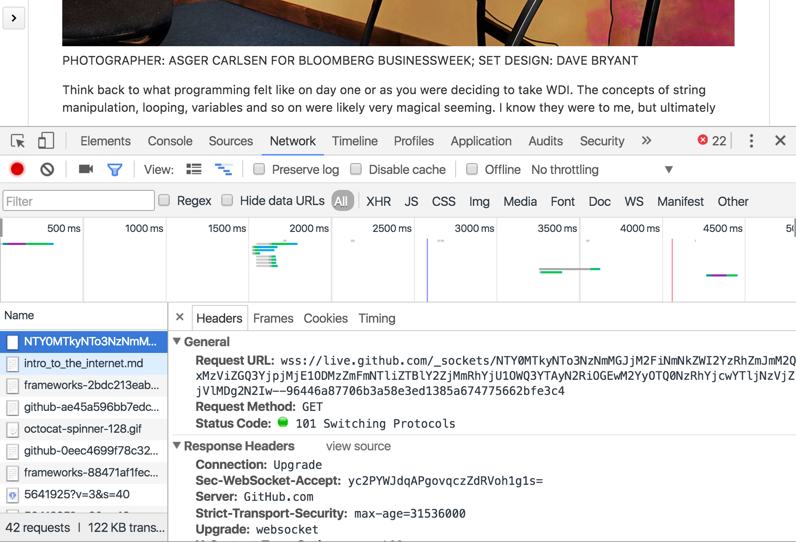

# Intro to the Internet and Node

## Objectives
*After this lesson, students will be able to:*

- Describe how information is sent from point A to point B over the internet
- Discuss how the request response cycle works from a conceptual perspective
  - nodes
  - clients/servers
- Discuss how the request response cycle works from a technical perspective
  - HTTP verbs
  - Status Codes
- Articulate what Node is and why it's popular

- Create a simple server using http module
- Send responses to the client on receiving any request
- Send responses to the client based on specific routes using control flow and the url module

## How does the internet work? (20 min)

Take five minutes to answer the following question:

In your own words, as well as using what you've learned about html/css/js, describe how the internet works?

I'm going to call on a couple of you, but would also like you all to type your own answer into Slack as we discuss!

<br />

### The Conceptual

The internet as a concept, ignoring all of the layers and layers of technical knowledge, is actually pretty straight forward, and we can approach it from three different angles to demystify it.

**ONE:** We can think of it as clients and servers, i.e. the web:


A **client**, your browser, makes a *request* through the internet to a **server** for a webpage, a song, an image, or some sort of _Resource_.

**What makes up a web page?**

**TWO:** We can think of it as a network of nodes. When your client makes a request, it knows the address but not exactly how to get there. The request literally propagates across the network, asking each server if it holds the webpage in question or if it knows where it is. A request will always try to find the fastest route of access and therefore, will not take the exact same path twice.

> In the early days of the internet, a server had a bug that caused it to think it could relay http requests in negative time. What this meant was that eventually this information propagated across the network where more and more traffic was getting sent through this one node, slowing it down more and more.

**SIDE NOTE**: Ethics — The Web is built on trust. And you, as new developers, are entering that world. So, be careful.  Trust is easily given, but also easily lost.

> Before we move forward, let's discuss one other example of network propagation.

> Back in 2008, the Pakistani government, in response to a video posted on YouTube, asked their ISP's (Internet Service Provider) to block YouTube. They accomplished this by changing the IP (Internet Protocol) address in their local DNS (Domain Name Server) so that any traffic initiating in Pakistan would see the wrong IP address, and instead, serve a page with the message that YouTube was not available and redirect traffic from that IP address to a Pakistani website.

> YouTube, like many large websites, has a number of IP addresses and spread the traffic between them. Requests get directed to whichever one is the least burdened — in essence, it tells people to go to Madison Square Garden. Once your nodes get there, they are then told which entrance to the Garden is the least crowded extrance.

> But the Pakistani announcement said that YouTube was located at 123 Censorship Row, Suite 305, Lahore, Pakistan — which looks to be far more specific and therefore looks like more useful information than “Madison Square Garden.”  Since the internet’s architecture still relies on trust, most networks — especially big ones — trust each other’s info without testing it. - From Wired


**THREE:** Finally, when thinking about requests and responses, the really mind-bending thing is recognizing and accepting that it is all simply text. Nothing more mystical or magical than plain ol' characters.

<br />

### How People Think the Internet Works:

**PHOTOGRAPHER**: ASGER CARLSEN FOR BLOOMBERG BUSINESSWEEK; 
<br />
**SET DESIGN**: DAVE BRYANT

Think back to what programming felt like on day one, or when you were deciding to take WDI. That was not that long ago.  The concepts of string manipulation, looping, variables and so on likely seemed pretty magical. I know they were to me, but ultimately, you are just making rules about the input that is received, and the appropriate output.

<br />

### What the Internet Actually Looks Like:

*The image below comes from the Chrome developer tools. Swedish! This is what an actual request looks like:*


Open Chrome dev tools, go to the network tab, refresh the page, and you can see all of the requests made for the content. You can see that there is a _lot_ more than just html and css. And if you click on one of those requests, you can then see the headers for it.

<br />

## The Technical

We are not in this class to _just_ demystify the internet.  We are here to learn how to send, receive, and interpret requests and responses to deliver something of value to our end users!

### HTTP verbs (10m)

To do this, we will be learning to speak the language that the internet speaks, **HTTP** or **Hypertext Transfer Protocol**. Requests and responses, as we have been discussing them, are a part of HTTP and are actually very straight forward.

> **EXERCISE**: Take three minutes to think about interactions (hint: think of *verbs*) that you use to engage with the internet and that result in a [persisted change](https://en.wikipedia.org/wiki/Persistence_(computer_science)). Meaning that when you do something on a website, turn your computer off, and then come back to that website the following day, you expect to see that your changes will still exist on the site.

> Write your responses into Slack.

HTTP is made up of seven **HTTP verbs**, though we will just focus on four and today we will only work with one.

- GET, POST, PUT, DELETE are the basic HTTP verbs for CRUD
	- Can anyone tell me what CRUD means? 
- Create(POST), Read(GET), Update(PUT), Delete(DELETE) — (CRUD)

If we think about this in terms of a blog: we can ask to see a blog post (Read/GET), we can create blog post and save it (Create/POST), we can then go and edit that blog post (Update/PUT), and finally if we are embarrassed by it, we can delete it (Delete/DELETE).

During Unit One, you likely inadvertently used the GET verb. Can you guess in what context you used it?

<br />

### Request-Response Cycle

So, let's get our hands dirty: what is the easiest way you can come up with to make a **GET** request?

EXERCISE: For the next 15 minutes, look at this [link](https://github.com/ATL-WDI-Curriculum/atl-wdi-9/blob/master/unit_02/w06d01/instructor_notes/curl_lab.md), read through the explanation of cURL and work through the exercises.

EXERCISE: 5 minute breakout session! With your partner, work together to come up with an explanation, in your own words, of how the internet works, HTTP verbs, and the request-response cycle.

> **SIDE NOTE**: What happens if you put 146.115.8.93 instead of www.google.com?

<br />

### The Web as _Resources_

So, what if I wanted to go across the web (or to the grocer) and GET some resource (like coconut oil)? I could find the unique IP address of that computer and make the request, or I could LOCATE its RESOURCES UNIVERSALLY by its **URL** (Uniform Resource Locator):

 

###  The Elements of a URL

**URL** stands for Uniform Resource Locator, and it ultimately is just a string of text characters used by web browsers, email clients and other software to format the contents of an internet request message.

Let's breakdown the contents of a URL:


```
    http://www.example.org/hello/world/foo.html?foo=bar&baz=bat#footer
    \___/  \_____________/ \__________________/ \_____________/ \____/
  protocol  host/domain name        path         query-string     hash/fragment
```

Element | About
------|--------
protocol | the most popular application protocol used on the world wide web is HTTP. Other familiar types of application protocols include FTP, SSH, GIT, FILE, HTTPS
host/domain name | the host or domain name is looked up in DNS to find the IP address of the host - the server that's providing the resource
path | web servers can organize resources into what is effectively files in directories; the path indicates to the server which file, from which directory the client wants
query-string | the client can pass parameters to the server through the query-string (in a GET request method); the server can then use these to customize the response - such as values to filter a search result
hash/fragment | the URI fragment is generally used by the client to identify some portion of the content in the response; interestingly, a broken hash will not break the whole link - this is not the case for the previous elements that we have discussed

<br />

_The Schema above is from [Tuts +](http://code.tutsplus.com/tutorials/http-the-protocol-every-web-developer-must-know-part-1--net-31177)_

When someone types `http://google.com` in a web browser, a new cycle resulting in an HTTP Request/ Response is initiated.  Essentially, your browser is saying:

_"Hey, there friend.  Please respond with the information located at the web address 'google.com/'."_

<br />

# Framing

## What is Node?

Node is a low-level, non-blocking, event-driven platform which allows you to write JavaScript on the server.

While it is possible to build web applications and APIs only using Node, we will actually be using a framework on top of Node, called Express. 

<br />

## Why do people love Node!?

Node is new and hot in the industry. And as you will discover, programmers love new to the point of insanity...

Developers and companies are excited about Node, because it allows fast, scalable APIs and websites written purely in JavaScript. Okay... so what?

There are really **two big takeaways** here: We are _familiar_ with JS and being able to use JS on the back end gives us the option to use a single programming language throughout an entire full-stack application. How cool is that?  So, when we get to Rails, you will use ruby on the back end and html, css and js on the front end.  And when you actually work on a full code base, Rails back ends are frequently optimized with [Lua](https://www.lua.org/) which is a db scripting language, or [Rust](https://www.rust-lang.org/en-US/). So now you have two to three back end languages. Not including your front end languages, and maybe you would like to run a framework too.  Now, your front end is not only JS, in actuality, it is a flavor of JS.

### Async

We won't dive too far into this and will talk about this in much more detail later. However, the other big difference is that Node.js is designed to be _event-driven_ and _asynchronous_. The opposite of this are servers that can only run one thing at a time. Node purposefully sends nearly everything to the background and in the meantime, allows the browser to keep going until all of thes processes are completed.

In layman's terms:

Imagine a paper delivery boy riding on his bike, delivering papers every morning. Imagine that he stops at each house, throws the paper onto your doorstep, and waits to make sure you come out and pick it up before moving on to the next house. That is what we would call _blocking_ – each line of code must finish before moving on to the next line of code.

Now, imagine the paperboy throwing the newspaper on your porch, but never stopping his bicycle.  He never stops.  He just keeps throwing papers on porches, so that by the time you pick it up he will be at least 3 to 4 houses down. That would be considered _non-blocking input/output (I/O)_, otherwise known as _asynchronous_. This is an extremely awesome feature of node since I/O tends to be very "expensive" as it takes many steps/time to retrieve data from memory.  And each step adds its own amount of delay time.

<br />

## Packages — What is NPM?

**npm** is Node's package manager. It is used to manage dependencies.

Node is made up of packages that exist inside and outside of the Node standard library.

Does anyone know what standard library refers to? You have interacted with standard library content and non-standard library content already.

This morning, we are just going to stick with the standard library, but during the rest of this unit we will be installing many different packages to build our front end and back end in Node.

<br />

## Routes / Paths / API

Anything in a URL that comes after the domain extension is called a route, path, or an api, including the path `/` i.e. `.com/`

We want to tell our server to listen for certain _routes_ and send some kind of response back.

Let's open up the [node_lab](https://github.com/ATL-WDI-Curriculum/atl-wdi-9/blob/master/unit_02/w06d01/student_labs/node_lab.md) at this link.
