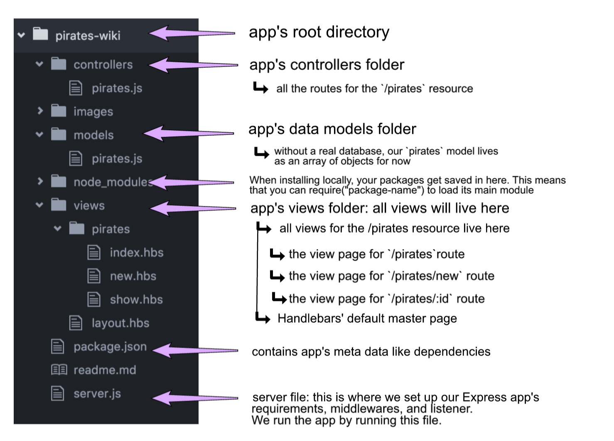
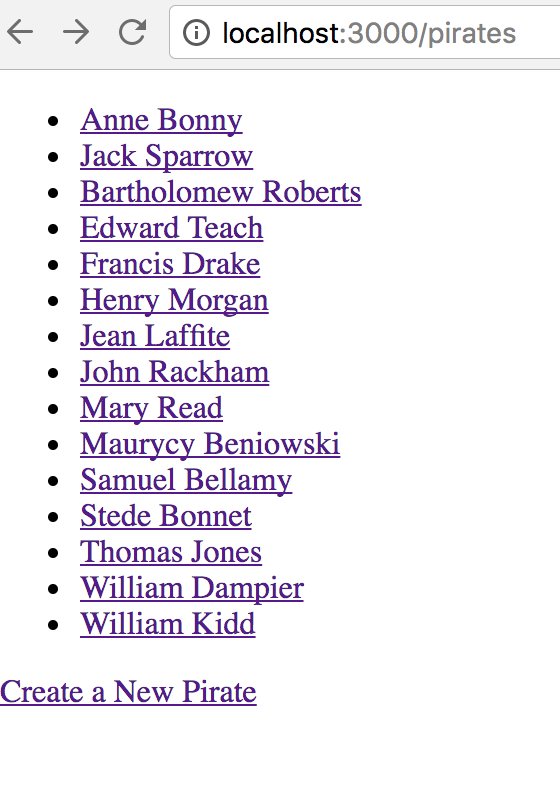
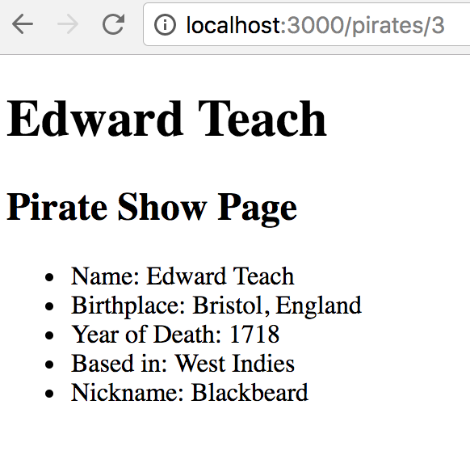
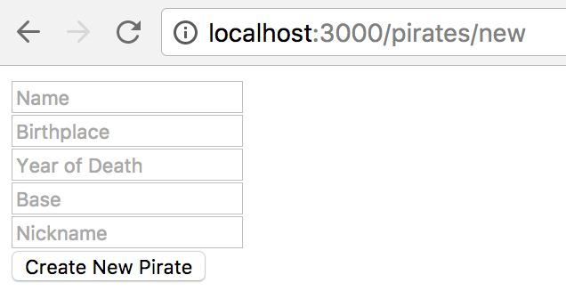

# Create and Read some Pirates

## Setup
1. Make sure that you are on the `master` branch of your `wdi-remote-...` repo.
Then run `git pull upstream master` to pull the latest materials from the
instructors' repository. You shouldn't hit a merge conflict here, but if you do, flag down an instructor right away.

2. Run `npm install` to install all the dependencies that are already in `package.json`.

### Exercise Objectives

- gain meaningful practice with CREATE and READ in CRUD
- gain more practice setting up an Express app with [MVC](https://www.tutorialspoint.com/mvc_framework/mvc_framework_introduction.htm) framework in mind
- gain understanding linking files in different folders together with relative paths
- gain more practice rendering views with Handlebars, including forms

<details><summary>**CRUD & RESTful RECAP**</summary>

CRUD stands for Create, Read, Update, and Destroy-- these are the fundamental actions we perform on data.

Tonight's homework is to make an app that will both **Read** and **Create** data for a single model (Pirates). **Update** and **Destroy** will come later.

### RESTFUL routing

There are seven RESTFUL routes, but tonight we are only using four.

**VIEW** routes (GET):

 - `index` displays an index of all resources.
 - `show` displays just one resource.
 - `new` provides a form for adding a new resources.
 - `edit` provides a filled-out form for an existing resource.

 The routes that have views are sent from a GET request.

 **REDIRECT** routes (POST, PUT, DELETE):

 - `create` takes the data from the `new` form.
 - `update` takes the data from the `edit` form.
 - `destroy` removes data.

 The routes that have redirects are sent from POST, PUT, and DELETE requests.

```
 In an app with full RESTFUL routes, you will have **four** views and **three** redirects.

 Later on, you could of course combine views to reduce navigation, but for now, there are four.

 Tonight's homework will use three of these views, `index`, `show`, and `new`, and just one redirect, `create`.
```
</details>

## APP
You will create an Express app that shows a list of famous pirates' names. When you click on a name, a new page lists more information about them.

The app will also be able to store new pirate entries. Clicking on "New Pirate" will create and store the new pirate, and be displayed on the index page.

### DIRECTIONS

- Complete an Express app called `pirates-wiki` (our current working directory)

- Your app's [MVC](https://www.tutorialspoint.com/mvc_framework/mvc_framework_introduction.htm) ("Models Views Controllers") folder structure has been created for you:
  - `models`: our Pirate data model lives here (do not modify)
  - `views`: your Handlebars views live here
  - `controllers`:  you will code your routes in `controllers/pirates.js`

  <details><summary>Folder Structure Breakdown of our App</summary>
  
  </details>

### Part 1: Set up Express server
  - In the `pirates-wiki` root directory, create `server.js`. This is where you will set up your express app's server.
    - Include requirements, middlewares, and listener to port 3000
    - Confirm your server is ready by running `node server.js` without error

### Part 2: Set up Controllers with Express Router

###server.js
- Before creating routes, we have to hook up our controllers to our server. Previously, we were writing our routes directly in `server.js`. Instead, we will use [express routers](https://expressjs.com/en/guide/routing.html), which creates a route handler module. In `server.js`, we can add it at the end of middlewares, before the listener like this:

```
//controllers for `/pirates` resource
var pirateController = require('./controllers/pirates.js');
app.use("/pirates", pirateController);
```

This tells our server that our controller files for `/pirates` live in the `./controllers/pirates.js` directory.

### controllers/pirates.js

In `controllers/pirates.js`, set up your requirements as follows. The basic structure of this file will be:

```
//requirements
var express = require("express");
var router = express.Router();
var pirates = require('../models/pirates.js');

//all routes for /pirate
router.get(.......)
router.post(......)
....etc

//exports
module.exports = router;
```

Notice we aren't using `app.get`, `app.post` like we would directly on the server file. The only difference here, with our router, is that we are going to use `router.get`, `router.post`. All the code in those methods will be the same as we've worked with before. Also notice `module.exports = router` is listed AFTER all the routes.

- *REPS*: In `controllers/pirates.js`, make your `index` and `show` routes for the pirates in the pirates model. Remember, all routes in this file correspond to the `/pirates` resource we've declared on `server.js`.

  - URI convention for index: GET `/`
  - URI convention for show: GET `/:id`


- Make a `new` route. All this should do is render the `new` view, you don't need to pass it data.
  - URI convention for new: GET `/new`
  - Place your `new` route above your `show route`, or the user will never get to it (they will always go to the `show` route instead). Can you explain why this might be?

  #### CREATE and req.body

- Make a `create` route.
  - URI convention for create: POST `/`  

- This will add the data from `new` into the Pirates array, and `redirect` to the `index`. The data will come from the request object-- inside an object called `req.body`. Does `req.body` exist without `body-parser`? Well no. `body-parser` adds in an empty body object to the request object that can later be populated with data. You can test the existence of req.body by console.logging req with and without `body-parser`.  
	- You will need to set up `body-parser` in your `server.js`.

	- Once you have required body-parser, this is the code to get it to work:

	```
	app.use(bodyParser.urlencoded({ extended: false }));
	app.use(bodyParser.json());
	```

	Note that you can find this code in the body-parser docs on the `npmjs` site.

<details><summary>.. Stuck?</summary>
- Because we are using Express routers, check your syntax for routers (ex: `router.get()` versus `app.get()`):

```
//what would normally be:
app.get("/", function(req, res){
    data: exampleData
});

//should actually be:
router.get("/", function(req, res){
    data: exampleData
});
```

- Understand in this homework, `router.get("/")` is the route for when the user hits `localhost:3000/pirates/`. We don't need to write `router.get("/pirates")` because that route would actually be accessible on `localhost:3000/pirates/pirates` which is not what we want. On `server.js` we already established all routes for the `/pirates` resource will be passed to this controller.

- Read the error message in BOTH the browser and terminal. If something cannot be found, did you provide the appropriate relative path to that file?

> Example: `../pirates` is a  different directory than `/pirates`

- Work step by step. Complete 1 step, test it out, and if it works, move on.

</details>

#### Testing POST requests
##### Network Tab
You can see the POST request go through in the Network tab in the Chrome console. Open up the console, hit the submit button for the request, and you will see the requests load. Click on the POST request, select the Headers, and scroll down to the bottom where you will see the form data.

This is good way to see if the form data has even been passed through the browser.

##### Postman / cURL
You can use Postman or cURL to send data to a server. Send data with Postman or cURL to your POST route, and set up the route simply to console.log req.body to see if the data has reached the server.


### Views

- `index.hbs` should just be an unordered list of the Pirate's names. Each name should link to the `show` page for that Pirate. There should be a link to `add a new Pirate`.

  <details><summary>Example output:</summary> </details>

- `show.hbs` should display the Pirate's name, birthplace, death_year, base, and nickname. There should be a link to return to the Pirates index.

<details><summary>Example output:</summary> 
</details>

- `new.hbs` should render a form where the user can enter a new Pirate's name, birthplace, death_year, base, and nickname.. The form will submit to the `create` route.

<details><summary>Example output:</summary> 
</details>

### Reach Goals

- On `index.hbs` display the total number of pirates. This number will change as you add more pirates.
- Make the app look nicer than just a plain html list. Use express.static('public') and integrate your css skills.

## Submitting Your Work

  When you're ready to submit your work,

  1.  Add, commit, and push your code to your fork of the class repo.
  2.  File an issue on the class repo titled "Your Name -- wXXdXX".

  The issue should include:

  -   A link that points back to your fork.

  -   A 'comfort' score on how you feel about the material, from 1 (very
      uncomfortable) to 5 (very comfortable)
