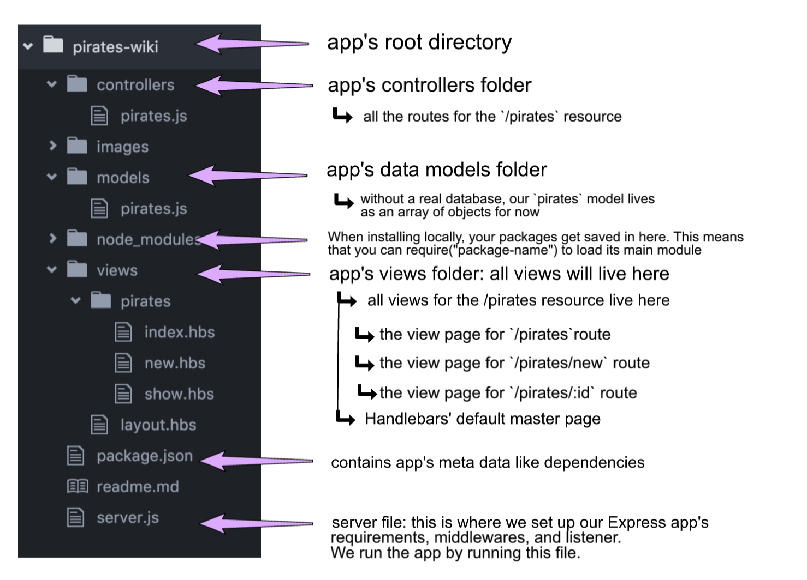

# Update and Destroy some Pirates

## Setup
1. Make sure that you are on the `master` branch of your `wdi-remote-...` repo.
Then run `git pull upstream master` to pull the latest materials from the
instructors' repository. You shouldn't hit a merge conflict here, but if you do, flag down an instructor right away.

2. Run `npm install` to install all the dependencies that are already in `package.json`.

### Exercise Objectives

- gain meaningful practice with UPDATE and DELETE in CRUD
- gain more practice setting up an Express app with [MVC](https://www.tutorialspoint.com/mvc_framework/mvc_framework_introduction.htm) framework in mind
- gain understanding on using `method-override` for non-POST/GET requests
- gain more practice rendering views with Handlebars, including forms

<details><summary>**CRUD & RESTful RECAP**</summary>

CRUD stands for Create, Read, Update, and Destroy-- these are the fundamental actions we perform on data.

Tonight's homework is to make an app that will both **Read** and **Create** data for a single model (Pirates). **Update** and **Destroy** will come later.

### RESTFUL routing

There are seven RESTFUL routes:

**VIEW** routes (GET):

 - `index` displays an index of all resources.
 - `show` displays just one resource.
 - `new` provides a form for adding a new resources.
 - `edit` provides a filled-out form for an existing resource.

 The routes that have views are sent from a GET request.

 **REDIRECT** routes (POST, PUT, DELETE):

 - `create` takes the data from the `new` form.
 - `update` takes the data from the `edit` form.
 - `destroy` removes data.

 The routes that have redirects are sent from POST, PUT, and DELETE requests.

```
 In an app with full RESTFUL routes, you will have **four** views and **three** redirects.

 Later on, you could of course combine views to reduce navigation, but for now, there are four.

 Tonight's homework will 1 additional view: `edit`. Yesterday, we built the other three views, `index`, `show`, and `new`.
```
</details>

## APP
You will complete our Pirate Wiki Express app by adding UPDATE and DELETE functionality.
Since the app can store new pirate entries, you can also update an existing pirate, and you can delete a pirate and it will be removed from the index page.

### DIRECTIONS

- You can choose to build on top of your app in yesterday's folder, or you can work in `pirates-wiki` in today's homework folder. The instructions below will be based off the provided code in `pirates-wiki`. In it we have a working solution of the CREATE and READ portions, along with the accompanied views. Today, you will add UPDATE and DELETE.

### Part 1: Understanding our Setup

- Your app's [MVC](https://www.tutorialspoint.com/mvc_framework/mvc_framework_introduction.htm) ("Models Views Controllers") folder structure has been created for you:
  - `models`: our Pirate data model lives here (do not modify)
  - `views`: your Handlebars views live here
  - `controllers`:  you will code your routes in `controllers/pirates.js`

  <details><summary>Folder Structure Breakdown of our App</summary>
  
  </details>

### Part 2: Setting up Controllers

###server.js
- Before creating routes, we have to hook up our controllers to our server. Previously, we were writing our routes directly in `server.js`. Instead, we will use [express routers](https://expressjs.com/en/guide/routing.html), which creates a route handler module. In `server.js`, we have added it at the end of the middlewares, before the listener like this:

```
//controllers for `/pirates` resource
var pirateController = require('./controllers/pirates.js');
app.use("/pirates", pirateController);
```

This tells our server that our controller files for `/pirates` live in the `../controllers/pirates.js` directory.

### controllers/pirates.js

In `controllers/pirates.js`, notice we aren't using `app.get`, `app.post` like we would directly on the server file. The only difference here, with our router, is that we are going to use `router.get`, `router.post`. All the code in those methods will be the same as we've worked with before. Also notice `module.exports = router` is listed AFTER all the routes.

#### DELETE
- *REPS*: In `controllers/pirates.js`, add your `delete` route for the pirates in the pirates model. Remember, all routes in this file correspond to the `/pirates` resource we've declared on `server.js`. Once this route is hit and the pirate gets deleted, redirect it back to the index page to be able to view those changes.
  - URI convention for delete: DELETE `/:id`

#### EDIT
- Make an `edit` route. This should render the `edit` view with a form and send pirate data to populate the forms.
  - URI convention for edit: GET `/:id/edit`

#### UPDATE
- Make an `update` route.
  - URI convention for update: PUT `/:id`  

- This will modify the data from `update` into the Pirates array, and `redirect` to the `index`. The data will come from the request object-- inside an object called `req.body`. Does `req.body` exist without `body-parser`? Well no. `body-parser` adds in an empty body object to the request object that can later be populated with data. `body-parser` has been set up in your `server.js`. Take a look and see how it was required and set up.

- We still need one more middleware for the `update` route. Because HTML forms don't make DELETE requests and only POST and GET requests, we have to install an npm package called `method-override`. Go ahead and install the package and set that up on `server.js`.

- How does the router know which pirate to update? We have `/:id` set up in the `update` route, but where is it coming from when our user hits the send button on the edit page? Maybe we can edit the `edit` route and pass along the id number somehow..

<details><summary>.. Stuck?</summary>
- Are you using the correct HTTP verb? A post request will be handled by the `router.POST` route, a get request would be handled by `router.GET`, etc.

- Because we are using Express routers, check your syntax for routers (ex: `router.get()` versus `app.get()`):

```
//what would normally be:
app.get("/", function(req, res){
    data: exampleData
});

//should actually be:
router.get("/", function(req, res){
    data: exampleData
});
```

- Understand in this homework, `router.get("/")` is the route for when the user hits `localhost:3000/pirates/`. We don't need to write `router.get("/pirates")` because that route would actually be accessible on `localhost:3000/pirates/pirates` which is not what we want. On `server.js` we already established all routes for the `/pirates` resource will be passed to this controller.

- Read the error message in BOTH the browser and terminal. If something cannot be found, did you provide the appropriate relative path to that file?

> Example: `../pirates` is a  different directory than `/pirates`

- Work step by step. Complete 1 step, test it out, and if it works, move on.

</details>


### Views

- `index.hbs` already exists, but go ahead and add 2 buttons for each pirate using Handlebars. Clicking on the "DELETE" button should delete the pirate from the page. Clicking on the "EDIT" button should take you to the edit page for that pirate.

<details><summary>Example output:</summary> 
</details>


- `edit.hbs` should render a form where the user can edit any/all of the Pirate's name, birthplace, death_year, base, and nickname. The form will submit to the `update` route.

  <details><summary>Example output:</summary> </details>


### Reach Goals
- Make the app look nicer than just a plain html list. Use express.static('public') and integrate your css skills.


## Submitting Your Work

  When you're ready to submit your work,

  1.  Add, commit, and push your code to your fork of the class repo.
  2.  File an issue on the class repo titled "Your Name -- wXXdXX".

  The issue should include:

  -   A link that points back to your fork.

  -   A 'comfort' score on how you feel about the material, from 1 (very
      uncomfortable) to 5 (very comfortable)
