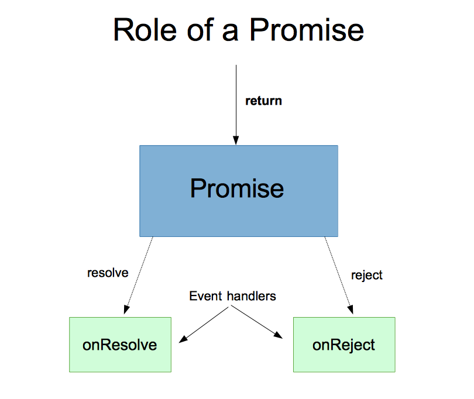

# JavaScript Promises

## Introduction

Welcome to the Promise land! (sorry) You have been sneakily using promises this whole class, but today, we will illuminate what exactly a promise is, and shed light on best practices to use while playing with promises.

## Objectives

* Describe the anatomy of a Promise
* Utilize Promises to manage asynchronous operations
* Correctly use a Promise chain
* Handle errors while working with Promises

<br>

## You Do

&#x1F535; **YOU DO**

Read this: https://spring.io/understanding/javascript-promises

<br>

## Non-Blocking Code in JavaScript

  Pop quiz! In the code below, which word will get printed first?

  ```js
  console.log('Red');
  console.log('Blue');
  ```

  What about now? Try it out for yourself and see what happens.

  ```js
  setTimeout(function(){ 
    console.log('Red'); 
  }, 0);
  console.log('Blue');
  ```

  JavaScript code is _non-blocking_ -- this means that each line of code begins
  to execute as soon as it possibly can, including before previous lines of
  code have finished executing.
  
  > "Isn't that really confusing? How could anyone write code when they can't be
  > sure about the order in which their lines will run?"

  Well, most of the time, each line of code executes so quickly that it isn't
  noticeable. But when you want to do things that are slow/take a long time,
  this behavior becomes very important.

  In the context of web applications, it's especially important to think about
  JavaScript's non-blocking behavior when your JS code is interfacing with
  another system or service, since there's no telling how long such a service
  might take to do its job. The most common examples of this are:

  -   Waiting on **DOM events** (driven by user interaction).

  -   Waiting for a **response to an HTTP request**.

  -   Waiting for a **database** to retrieve/modify a piece of data.

  -   Waiting for a **timer** to run out.

  -   Waiting for the **filesystem** to read from, or to write to, a file.

  -   Hitting a 3rd party API for **authentication** (Facebook, Twitter, etc)

In all of these examples, your JavaScript code is _waiting for something to happen_, and there's no telling how long that 'something' will take.

So how can we tell our code to wait for something to finish?
Node actually uses the same approach that the browser does -- callbacks.
By setting a callback as an event handler, we can defer its execution until
the event it's listening for occurs. Future steps can then be triggered
by more callbacks.

  ```js
  var stepTwo = function(num){
    // ... Do Something ... ///
  };

  var eventHandler = function(){
    // ... Do Something ... ///
    result = 42;
    stepTwo(42)
  }
  ```

<br>

## "Callback Hell" : Drawbacks to Callbacks

  OK, that's fine for doing things that involve one 'slow' step. But what if
  there's _more than one_ 'slow' thing we have to deal with?

  

  

  For instance, let's say we need to do all of the following:

  1. Read in data from a file
  2. Parse the data as CSV content
  3. Use the content to make an HTTP request.
  4. Take the response and store data into a database.
  5. Send a response back to the user.

Phew. How might that look if we try to use callbacks to handle that whole process?

Maybe something like this?

  ```js
  fs.readFile('./data-csv', function(err, data){  // read a file
    if(err) throw err;

    csv.parse(data, function(err, csvData){       // parse the data as CSV
      if(err) throw err;

      var url = csvData[0].url;
      var req = http.request({host: url}, function(res){ // make an HTTP request
        var responseData = '';
        res.setEncoding('utf8');
        res.on('data', (chunk) => {
          responseData += chunk;
        });
        res.on('end', () => {                            // collect the response
          ResponseMessages.create({body: responseData},  // add record to a DB
            function(err, messageRecord){
            if (err) throw err;

            res.render('response', responseData);
          })
        });
      });
      req.on('error', (e) => {
        console.log(`problem with request: ${e.message}`);
      });

    })

  });
  ```

  

  Wow, that's some deep nesting. This code looks really complicated and messy.
  It's not easy to follow. And on top of all that, it's duplicative -- do you
  really need a separate system for handling errors at every stage in the
  process?
  
<br>

## Drawbacks to Callbacks

Asynchronous code necessitates callbacks.
But dealing with lots of callbacks can be tricky:

-   Callbacks can be messy when they're nested: "callback hell".
    - http://callbackhell.com/
-   Each callback will have to handle it's own errors if necessary.
-   In complex programs, it will be hard to tell in what order callbacks fire.

Fortunately, there's a better way: Promises.

<br>


## Why Promises?

Promises are an alternative to directly using callbacks. Promises allow us to write asynchronous code that looks like synchronous code. Promises create the illusion of returning values or throwing errors from within our callbacks. While promises do not replace callbacks--promises depend on callbacks--they provide a layer of abstraction between you and callbacks, enabling you to prevent callback hell.

Promises offer several advantages over callbacks.

-   Promises, like callbacks, make asynchronicity explicit.
-   Promises, unlike callbacks, clarify the order of execution.
-   Promises are easier to read than callbacks.
-   Promises can simplify error handling.


### Anatomy of a Promise



### Role of a Promise

A promise represents a value that will be available for use in the future, 
but is not available now. Think of it like an IOU for the actual value. Once
it **resolves**, it will pass the value it's standing in for to a function you
provide for it to invoke. Like an IOU, it can also "bounce", or **reject**, and 
fail to provide the value it's standing in for. Promises also provide a way to 
deal with this possibility.

Promises are always in one of 3 states:

- pending
- rejected
- resolved

<br>

## Using a Promise

A promise takes an anonymous function with two parameters; `resolve` and `reject`.
The promise resolves when `resolve` is called, and is rejected when `reject` is 
called.


### `Promise.then` and `Promise.catch`

The value passed to `resolve` will be the argument passed to the resolution 
handler you register by calling the promise's `then` method. Likewise with the 
value passed to `reject` and the rejection handler registered by calling 
the promise's (or a chained promise's) `catch` method.

Each takes one argument, a function. Here is a
usage example featuring an arbitrary promise, `somePromise`:

```js
somePromise
    .then(function(resolutionValue) {
        console.log("somePromise resolved with value " + resolutionValue);
        doSomethingWith(resolutionValue);
    })
    .catch(function(rejectionValue) {
        console.error(rejectionValue instanceof Error ?
            rejectionValue :
            "somePromise rejected with value " + rejectionValue);
    });
```

#### `.then`

`then` is a method on every `Promise` object. It is used to register an event
handler for the promise's "resolve" event. When the promise resolves, the handler
is invoked and passed the value the promise resolved to as its argument.

#### `.catch`

`catch` is a method on every `Promise` object. It is used to register an event
handler for the promise's "reject" event. When the promise rejects, the handler
is invoked and passed the value (usually an `Error` object) the promised rejected
with as its argument.


<br>

## Promises Example

A promise is like an IOU in real life. Let's say that your kid promises to clean his room by the end of the day. If he doesn't, the promise fails. Further, let's say that we also have a taking out the garbage function that depends on the room successfully being cleaned. Also, once the room has been cleaned and we've taken out the garbage we will get some ice cream as a reward.

```js
var promiseToCleanTheRoom = new Promise(function(resolve, reject) {
  // cleaning the room code would go here
};
```

- We can use the `new Promise()` constructor function to instantiate a new instance of a promise.
- Promises take a callback function with 2 arguments:
    - **resolve** means the promise is fulfilled
    - **reject** means the promise has not been fulfilled 

Let's set up a status based on whether or not the room has been cleaned

```js
var promiseToCleanTheRoom = new Promise(function(resolve, reject) {
  // cleaning the room code would go here (e.g.- vaccum, dust, make the bed, etc)
    
  var isClean = true;

  if (isClean) {
    resolve('Clean'); //run this function if true
  } else {
    reject('not Clean'); //run this function if false
  }
});
```
#### Promise Execution

Our promise may take some time to execute which means we're gonna have to wait for it. The `.then` method is called when the promise is resolved. `.then` takes a callback function that will only fire if the promise is resolved. We can pass arguments into the callback.

```js
var promiseToCleanTheRoom = new Promise(function(resolve, reject) {
// cleaning the room code would go here (e.g.- vaccum, dust, make the bed, etc)
    
  var isClean = true;

  if (isClean) {
    resolve('Clean'); //run this function if true
  } else {
    reject('not Clean'); //run this function if false
  }
});

promiseToCleanTheRoom.then(function(fromResolve){
  console.log(`The room is ${fromResolve}`);
})
```

We can chain another method called `.catch` to execute if the promise is rejected:

```js
var promiseToCleanTheRoom = new Promise(function(resolve, reject) {
// cleaning the room code would go here (e.g.- vaccum, dust, make the bed, etc)
    
  var isClean = true;

  if (isClean) {
    resolve('Clean'); //run this function if true
  } else {
    reject('not Clean'); //run this function if false
  }
});

promiseToCleanTheRoom
  .then(function(fromResolve){
    console.log(`The room is ${fromResolve}`);
  })
  .catch(function(fromReject){
    console.log(`The room is ${fromReject}`);
  })
```

Update `var isClean = false;` and run the code again. The `.catch` method should execute.


#### Let's remove some garbage and get ice cream!

Promises depend on each other. We have to finish one promise before we can start another one. So, we can't remove the garbage until we finish cleaning the room. Further, we can't get some ice cream until we finish taking out the garbage.

Assuming the room has been cleaned, let's add another `.then` method to the chain (remember to set your `var isClean` back to `true`. We'll aso add a `return` statement to pass something onto the next `.then()` handler in the chain. This could be data, a message, etc.

```js
var promiseToCleanTheRoom = new Promise(function(resolve, reject) {
// cleaning the room code would go here (e.g.- vaccum, dust, make the bed, etc)
    
  var isClean = true;

  if (isClean) {
    resolve('Clean'); //run this function if true
  } else {
    reject('not Clean'); //run this function if false
  }
});

promiseToCleanTheRoom
  .then(function(fromResolve){
    console.log(`The room is ${fromResolve}`);
    return "Let's take out the garbage!"; // whatever is returned will be passed to the next `.then()` handler
  })
  .then(function(message){
    console.log(message);
  })
  .catch(function(fromReject){
    console.log(`The room is ${fromReject}`);
  })
  
// The room is Clean
// Let's take out the garbage!
```

<br>

&#x1F535; **YOU DO**

Add a 3rd `.then()` handler that will console.log "Room cleaned, garbage taken out, let's go get some ice cream!"

<br>

## Independent Practice
Look in today's student labs folder for `promises-lab-starter`.

<br>

## Additional Resources

-   [Clean Room Example Video](https://www.youtube.com/watch?v=s6SH72uAn3Q)
-   [Promise - JavaScript | MDN](https://developer.mozilla.org/en-US/docs/Web/JavaScript/Reference/Global_Objects/Promise)
-   [Promises](https://www.promisejs.org/)
-   [Promisees · Courtesy of ponyfoo.com](http://bevacqua.github.io/promisees/)
-   [wbinnssmith/awesome-promises: A curated list of useful resources for JavaScript Promises](https://github.com/wbinnssmith/awesome-promises)
-   [How to escape Promise Hell — Medium](https://medium.com/@pyrolistical/how-to-get-out-of-promise-hell-8c20e0ab0513#.4wtj9hlvw)
-   [Promise on MDN](https://developer.mozilla.org/en-US/docs/Web/JavaScript/Reference/Global_Objects/Promise)
-   [We Have a Problem with Promises](http://pouchdb.com/2015/05/18/we-have-a-problem-with-promises.html)
