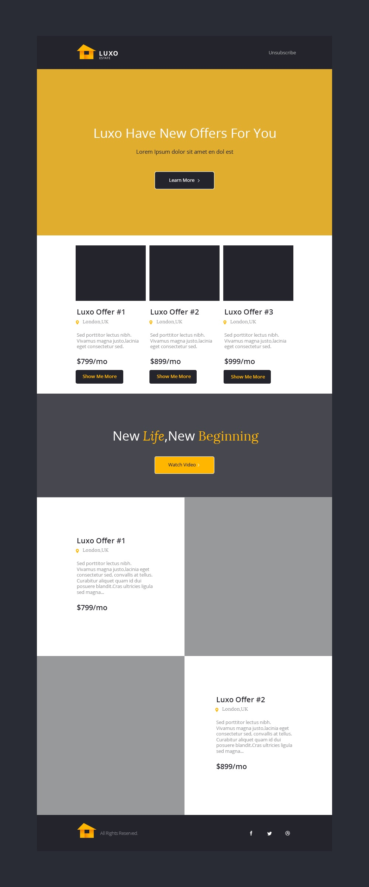

# Front End Skills: PSD to HTML

“PSD (Photoshop Document) to HTML” is a workflow. Usually a web designer will design a high-res pixel-perfect mockup in Photoshop of **exactly** what you want your site to look like. The web developer then turns that mock up into code using HTML, CSS, and Javascript.

## Directions

Your job is to turn a PSD mockup for your first client, Luxo Real Estate, into a website! You will write your code in `index.html` and `style.css`. The logo is in the `images` folder.

The black and grey boxes are placeholders for images. You can choose to leave them black/grey or replace them with images.

### Strategies

- Assess the mockup before you begin coding.
- Work 1 section at a time (build HTML + CSS)
- Use developer tools to get the exact color values (eyedropper tool)
- Not sure how to do something? Google it!

- Responsive Design:
  - Normally you would open open the PSD file in Photoshop (or a photo editor of your choice) and calculate the dimensions like `height` and `width` of block elements to match the mockup's dimensions.
  - use % for widths, and `em` for height.
