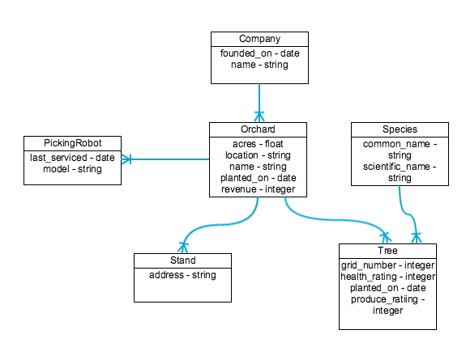

# Domain Modeling & ERDs

## Learning Objectives

- Draw an Entity Relationship Diagram (ERD)
- Identify and diagram one-to-one, one-to-many and many-to-many relationships between data entities
- Distinguish between entities and attributes
- Discuss data normalization needs and techniques

## Framing

User stories clarify the features we need for a good user experience. We use
them to prioritize order and scope. Today, we will identify the information
required to support those user stories.  We refer to this as the Domain, or
Domain Model. The Domain Model specifies the data and the relationships between
this data. We use it to decide what needs to be persisted.

## Domain Modeling (20 minutes / 0:20)

Domain Modeling allows us to outline the data values that we need to persist.

- We only consider the attributes of our data, not the behavior of our application.
- A domain model in problem solving and software engineering is a conceptual
model of all the items/topics related to a specific problem.
- It describes the various entities, their attributes, roles and relationships,
plus the constraints that govern the problem domain.

The big takeaway here is that domain modeling **does not describe solutions to the problem**. Instead, it defines how our data is structured.

### ERDs

An ERD -- or "Entity Relationship Diagram" -- is a tool we use to visualize and describe the data relating to the
major entities that will exist in out programs.

- Ultimately lends itself to planning out and creating our database table
structure.
- Again, we keep our data separate from our behavior.

#### Example: An Orchard

Take a minute to look through the below diagram. Note down any observations you have.

- The squares represent our entities and are filled with the attributes associated with our entity.
- The arrows between the squares indicate how the entities relate to one another.

##### Relationships

**One-to-one:** A Country has one Capital City

- Usually denotes that one entity should be an attribute of the other
- Usually separated for physical space considerations

**One-to-many:** A Location has many Cohorts

- The most common relationship you will define in WDI.

**Many-to-many:** A Doctor has many Patients through Appointments, and a Patient has many Doctors through Appointments.

- Requires a join table or a 3rd entity. In this example, that is Appointments.

#### Example: Garnet

ERDs get more complex the larger your application becomes. Nevertheless, they are still a useful tool when planning and developing. The instructors reference this diagram all the time!

#### You Do: Library ERD Example (15 minutes / 0:35)

> 10 minutes exercise. 5 minutes review.

Come up with an example ERD for an application that manages a library.

## You Do: Database Design Challenges – Model Your Favorite Apps

As an extension of your practice earlier, it's time to challenge yourself to analyze an existing application and try to understand the models and relationships behind it. Not every web application uses a SQL database, but it's great to practice data modeling, regardless.

### Requirements

- Pick one or more of the following analyze what it primarily does & try to draw the tables & relationships:

  - Facebook
  - Twitter
  - Reddit
  - Instapaper
  - AirBnB
  - Tumblr
  - ESPN

### Deliverable

One or more ERD diagrams, using crow's foot notation, of whatever app you choose.  For example:

  

> Note: this example has "Items" as placeholders for the attributes.

## Additional Resources

- [crows foot notation cheat sheet](http://www.vivekmchawla.com/content/images/2013/Dec/ERD_Relationship_Symbols_Quick_Reference-1.png)